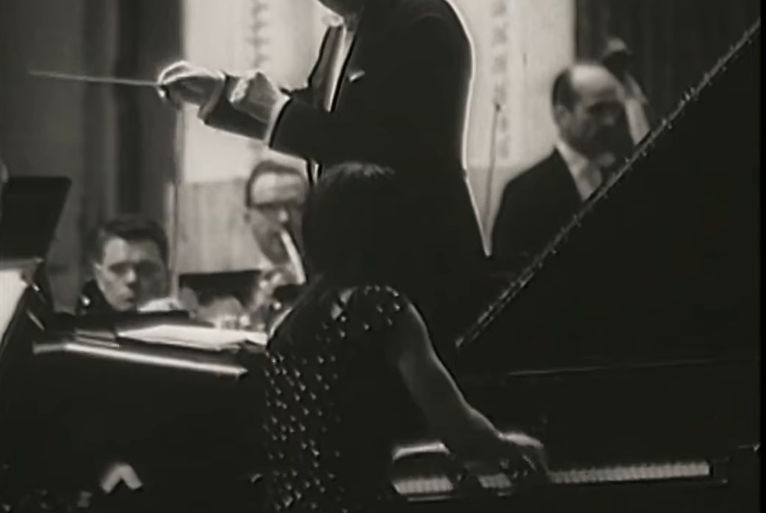

<br>

```{r, out.width = "350%", eval=TRUE, echo=FALSE, warning = F, message = F}
library(knitr)

```
**Image credit:** Footage from Telewizja Polska Archives. Martha Argerich in 
the final round of the 7th Chopin Competition, 1965. 

# Introduction

The International Chopin Piano Competition, held every five years in Warsaw, 
is one of the most prestigious piano competitions in the world, with winners
including such famous performers as Maurizio Pollini, Martha Argerich, Krystian
Zimmerman, Garrick Ohlsson, Dang Thai Son, and Yundi Li. In this competition,
performers are asked to prepare programs consisting entirely of works by 
Frederic Chopin, spanning his entire output. 

The 18th competition was held in October, 2021, and was open to pianists born
between 1990 and 2004. The competition consisted of a preliminary round, three
main competition rounds, and a final round, with the field of pianists narrowing
at each step. There were strict repertoire requirements for each of the 
competition stages such that pianists were evaluated on similar criteria. For
instance, in the first main stage, pianists were asked to play two etudes from
a specified list, one piece from a specified list of select nocturnes and the 
slow etudes, and a large-scale work from a specified list; in the final round, 
pianists were asked to play either of Chopin's concertos*. 

# Project objectives

Your goal is two-fold. First, create an interesting descriptive analysis of the
entire competition that describes at least one interesting aspect of the
competition. What trends or patterns might you be able to visualize or describe? 

Secondly, you must evaluate whether there might be potential "repertoire 
effects." In the final round of the 17th competition, 9 finalists played the 
e minor concerto and only 1 finalist playing the f minor concerto. Are certain
repertoire choices associated with better competition outcomes (for instance, 
in the first main stage, do ballades or scherzos do "better")? 

Clearly write any model(s) using correct mathematical notation. Care should be 
made to use readily-interpretable models, with conclusions and interpretations 
able to be understood by allied researchers and the knowledgeable public.

<b>Detailed instructions, the data, and data descriptions are available in the
course [GitHub repository](https://github.com/sta440-sp22)</b>.

# Learning objectives

- Solidify skills in reproducible research and programming, including 
version-control and collaboration via GitHub
- Critically think about reasonable analysis approaches in the context of 
real-world data
- Express statistical models clearly and correctly
- Develop scientific writing skills by providing clear, concise, data-driven 
conclusions suitable for allied researchers

# Project timeline

- **Group**: Report and reproducible code
  - Due Friday, February 25
- **Group**: Revised report and response to reviewers
  - Due Friday, March 18

**Note**: each team's GitHub report repository and commit history will also be
evaluated by the instructor. The GitHub repository must contain the reproducible
R Markdown document corresponding to the submitted reports, and will be checked
throughout the course of the case study to ensure all team members are making
meaningful contributions to the project.

# References

[1] XVIII Konkurs Chopinowski, Warszawa. [https://chopin2020.pl/en/](https://chopin2020.pl/en/). Accessed January 1,
2022.

* shout-out to the Warsaw Philharmonic Orchestra in 2015 who had to basically 
sit through accompanying 9 e minor concertos in a row, RIP.