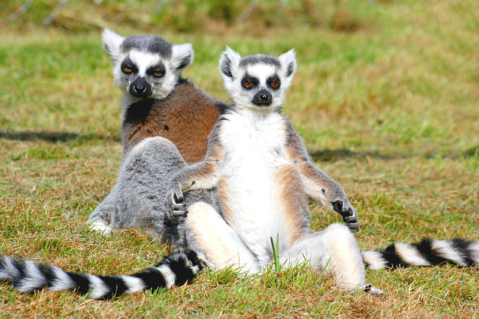

<br>

```{r, out.width = "350%", eval=TRUE, echo=FALSE, warning = F, message = F}
library(knitr)

```
**Image credit:** Kevin Law, used under [CC BY-SA 2.0](https://creativecommons.org/licenses/by-sa/2.0/deed.en) license.

# Introduction

*Lemuroidea* is a primate superfamily that contains around 100 species of 
primates commonly known as lemurs. Lemurs are a diverse group of animals, but
unfortunately many species are endangered due to human activity. However, they
are an important group of animals to research, as their taxonomic and physical
characteristics can provide researchers greater understanding of human 
evolution. 

The Duke Lemur Center, established over 50 years ago, is a renowned research 
institute that houses the most diverse population of lemurs outside of 
Madagascar. Since its inception, the Lemur Center has cared for over 4,000
animals, including 200 currently in its care. The Lemur Center is a world leader
in conservation and preservation of primates, and as part of its research
mission has made available detailed and verified life histories for over 3,600
animals.

# Project objectives

Your goal is simply to identify whether there are systematic differences in
longetivity among and between lemurs. For instance, are there differences based
on sex? Taxon? Time of year when the animals was born? Whether the animal was 
born in captivity? Etc. Your primary analysis should represent something of
scientific or sociological interest to researchers, and account for potential
confounders in any modeling approach.

Clearly write any model(s) using correct mathematical notation. Care should be 
made to use readily-interpretable models, with conclusions and interpretations 
able to be understood by allied researchers and the knowledgeable public.

<b>Detailed instructions, the data, and data descriptions are available in the
course [GitHub repository](https://github.com/sta440-sp22)</b>.

# Learning objectives

- Solidify skills in reproducible research and programming, including 
version-control and collaboration via GitHub
- Critically think about reasonable analysis approaches in the context of 
real-world data
- Express statistical models clearly and correctly
- Develop scientific writing skills by providing clear, concise, data-driven 
conclusions suitable for allied researchers

# Project timeline

- **Group**: Report and reproducible code
  - Due Friday, April 8
- **Group**: Revised report and response to reviewers
  - Due Friday, April 22

**Note**: each team's GitHub report repository and commit history will also be
evaluated by the instructor. The GitHub repository must contain the reproducible
R Markdown document corresponding to the submitted reports, and will be checked
throughout the course of the case study to ensure all team members are making
meaningful contributions to the project.

# References

[1] Zehr SM, Roach RG, Haring D, Taylor J, Cameron FH, and Yoder AD (2014). 
"Life history profiles for 27 strepsirrhine primate taxa generated using captive 
data from the Duke Lemur Center." *Scientific Data* **1**:140019.

[2] Duke Lemur Center. "History and Mission." [https://lemur.duke.edu/about/history-mission/](https://lemur.duke.edu/about/history-mission/). Accessed January 1, 2022.

[3] Garbutt N (2007). *Mammals of Madagascar, A Complete Guide.* A&C Black 
Publishers. ISBN 978-0-300-12550-4.

[4] Groves, CP (2005). "Strepsirrhini." In Wilson DE, Reeder DM (eds.). 
*Mammal Species of the World: A Taxonomic and Geographic Reference.* 3rd ed., 
Johns Hopkins University Press: pp. 111–184. ISBN 978-0-8018-8221-0. 