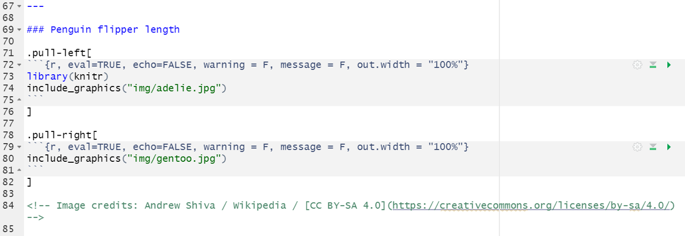
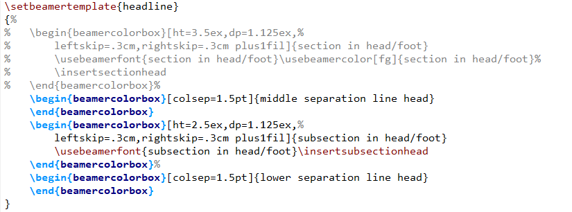

```{r setup, include=FALSE}
# R options
options(
  htmltools.dir.version = FALSE, # for blogdown
  show.signif.stars = FALSE,     # for regression output
  warm = 1
  )
# Set dpi and height for images
library(knitr)
# ggplot2 color palette with gray
color_palette <- list(gray = "#999999", 
                      salmon = "#E69F00", 
                      lightblue = "#56B4E9", 
                      green = "#009E73", 
                      yellow = "#F0E442", 
                      darkblue = "#0072B2", 
                      red = "#D55E00", 
                      purple = "#CC79A7")

options(htmltools.dir.version = FALSE)
knitr::opts_chunk$set(
	fig.align = "center",
	fig.height = 3.75,
	fig.width = 6.25,
	message = FALSE,
	warning = FALSE
)
```

```{r echo=FALSE, message=FALSE, warning=FALSE}
library(tidyverse)
library(knitr)
```

### Software

- PowerPoint / Keynote (easy, WYSIWYG)
- LaTeX Beamer / R Markdown packages (clean, consistent, eventually straightforward)
- Random online things like Prezi (don't do this)


---

### `xaringan`

`xaringan` is an R package that lets users create clean HTML5 slides directly
in R Markdown. One benefit is that you can specify your own .css files for
formatting purposes. As well, since we're using R Markdown, we can directly
run R commands, allowing us to create fully reproducible slide decks.

Documentation is available [here](https://bookdown.org/yihui/rmarkdown/xaringan.html).

---

### `xaringan` examples

Some examples of slides created using the `xaringan` package in R Mardown are
those from STA 440! Links to the EM (1) lecture and spatial (3) lecture are
provided here:

- [EM (1)](https://www2.stat.duke.edu/courses/Fall21/sta440.001/slides/em-1.html)
- [Spatial (3)](https://www2.stat.duke.edu/courses/Fall21/sta440.001/slides/spatial-3.html)

---

### `xaringan` examples

```{r, echo = F, out.width="100%"}
library(knitr)

```

---

### `xaringan` examples

```{r, echo = F, out.width="100%"}
library(knitr)

```

---

### `xaringan` examples

```{r, echo = F, out.width="100%"}
library(knitr)

```

---

### `xaringan` examples

```{r, echo = F, out.width="100%"}
library(knitr)

```

---

### `xaringan` examples

```{r, echo = F, out.width="90%", fig.align = "center"}
library(knitr)

```

---

### beamer

beamer is a LaTeX class that creates consistent, clean presentations. Like 
`xaringan`, it has a variety of built-in templates, but you can build your own
or specify options as well. 

There are ways of integrating beamer with R in 
order to create fully reproducible presentations (e.g., Sweave), but they're a
bit tougher to get started with. You will need a LaTeX installation on your
computer and some sort of editor -- I'm partial to TeXStudio as my LaTeX editor,
but others exist as well (e.g., TeXWorks, etc.).

The GitHub repo is available [here](https://github.com/josephwright/beamer), and
some helpful tutorials are available [here](https://math-linux.com/latex-26/article/how-to-make-a-presentation-with-latex-introduction-to-beamer)
and [here](https://en.wikibooks.org/wiki/LaTeX/Presentations).

---

### beamer examples

Some examples of slides created using the beamer class in LaTeX are
those from STA 102. Links to the hypothesis testing lecture is provided here:

- [Intro to hypothesis testing](https://www2.stat.duke.edu/courses/Fall20/sta102/slides/lec-10.pdf)

---

### beamer examples

```{r, echo = F, out.width="90%", fig.align = "center"}
library(knitr)

```

---

### beamer examples

```{r, echo = F, out.width="100%", fig.align = "center"}
library(knitr)

```

---

### beamer examples

```{r, echo = F, out.width="100%", fig.align = "center"}
library(knitr)

```

---

### beamer examples

```{r, echo = F, out.width="100%", fig.align = "center"}
library(knitr)
include_graphics("img/beamer4.png")
```

---

### beamer examples

```{r, echo = F, out.width="100%", fig.align = "center"}
library(knitr)

```

---

### Today's activity

.question[
Once again, create a brief 5-slide deck regarding the DIG trial (feel free to
build off of the one you created last class) - try to have a complete product
by the end of class today, and create the deck in either `xaringan` in R 
Markdown or beamer using LaTeX if you are able to.
]