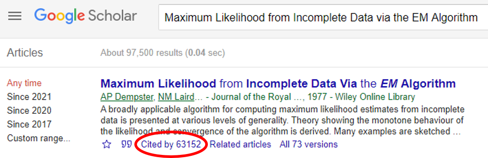
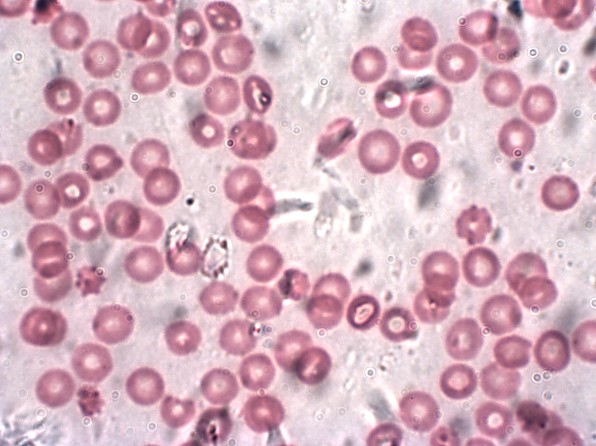
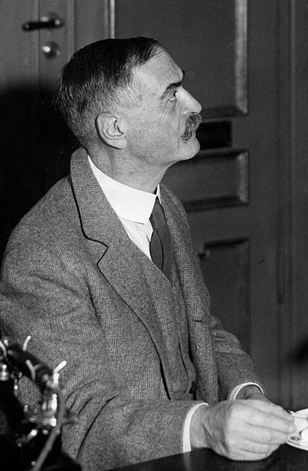
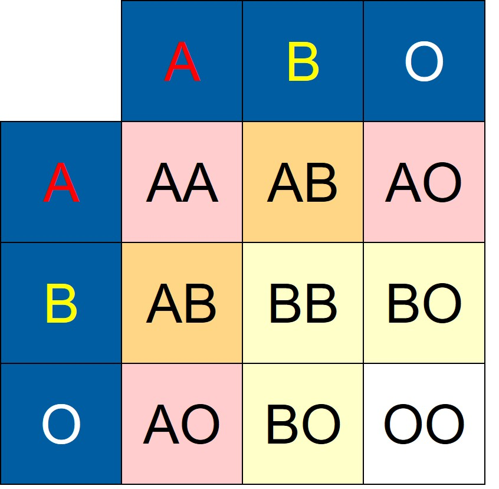

```{r setup, include=FALSE}
# R options
options(
  htmltools.dir.version = FALSE, # for blogdown
  show.signif.stars = FALSE,     # for regression output
  warm = 1
  )
# Set dpi and height for images
library(knitr)
# ggplot2 color palette with gray
color_palette <- list(gray = "#999999", 
                      salmon = "#E69F00", 
                      lightblue = "#56B4E9", 
                      green = "#009E73", 
                      yellow = "#F0E442", 
                      darkblue = "#0072B2", 
                      red = "#D55E00", 
                      purple = "#CC79A7")

options(htmltools.dir.version = FALSE)
knitr::opts_chunk$set(
	fig.align = "center",
	fig.height = 3.75,
	fig.width = 6.25,
	message = FALSE,
	warning = FALSE
)
```

```{r echo=FALSE, message=FALSE, warning=FALSE}
library(tidyverse)
```

### A disclaimer

Today's (and next time's) lectures are introductory surface level treatments of
the EM algorithm. We focus on applications and use cases -- there are no 
theoretical results presented (even for important subjects like variance
estimation). 

As well, we are slightly "hand-wavy" at times. in formal treatments of the EM 
algorithm you may see certain notaional conventions (e.g., defining $Q$ 
functions) that we will explain more intuitively with words and visualizations.

There is much to discuss regarding the EM algorithm both theoretically and in 
application. In STA 440, we will focus on using and implementing the EM 
algorithm in practice to tackle real-world datasets instead of focusing on
theoretical considerations.

---

### Penguin flipper length

.pull-left[
```{r, eval=TRUE, echo=FALSE, warning = F, message = F, out.width = "100%"}
library(knitr)

```
]

.pull-right[
```{r, eval=TRUE, echo=FALSE, warning = F, message = F, out.width = "100%"}

```
]

<!-- Image credits: Andrew Shiva / Wikipedia / [CC BY-SA 4.0](https://creativecommons.org/licenses/by-sa/4.0/) -->

---

### Penguin flipper length

```{r, echo = F, fig.height = 6, fig.width = 10}
library(palmerpenguins)
data(penguins)
penguins <- penguins %>% 
  mutate(temp = 0,
         temp2 = "????")
penguins %>% 
  filter(species != "Chinstrap") %>% 
  ggplot(data = ., aes(x = flipper_length_mm, fill = species)) + 
  geom_density(alpha = 0.4, adjust = 1.5) +
  xlim(c(160, 240)) + 
  geom_histogram(color = "darkgray", aes(y=..density..),
                 alpha = 0.5, binwidth = 3, position = "identity") +
  theme_minimal() +
  theme(axis.title.y = element_blank(),
        axis.text.y = element_blank(),
        text = element_text(size=15),
        panel.grid.major.y = element_blank(),
        panel.grid.minor.y = element_blank(),
        legend.position = "bottom") +
  labs(x = "Flipper length (mm)", fill = "Species",
       title = "")
```

---

### Penguin flipper length

```{r, echo = F, fig.height = 6, fig.width = 10}
penguins %>% 
  filter(species != "Chinstrap") %>% 
  ggplot(data = ., aes(x = flipper_length_mm, y = temp)) + 
  # geom_density(alpha = 0) +
  xlim(c(160, 240)) + 
  ylim(c(0, 6)) + 
  geom_point(aes(x = flipper_length_mm, y = temp, color = species), 
             alpha = 0.15, shape = 19, cex = 4) +
  theme_minimal() +
  labs(x = "Flipper length (mm)", color = "Species",
       title = "") +
  theme(axis.title.y = element_blank(),
        axis.text.y = element_blank(),
        text = element_text(size=15),
        panel.grid.major.y = element_blank(),
        panel.grid.minor.y = element_blank(),
        legend.position = "bottom")

```

Let's say we have observations and know that they come from two separate normal 
distributions. 

---

### Penguin flipper length

```{r, echo = F, fig.height = 6, fig.width = 10}
penguins %>% 
  filter(species != "Chinstrap") %>% 
  ggplot(data = ., aes(x = flipper_length_mm)) + 
  # geom_density(alpha = 0) +
  xlim(c(160, 240)) + 
  geom_point(aes(x = flipper_length_mm, y = temp, color = species), 
             alpha = 0.15, shape = 19, cex = 4) +
  stat_function(fun = dnorm,
                args = list(mean = 189.954, 
                            sd = 6.539),
                color = "darkgray", alpha = 0.7) +
  stat_function(fun = dnorm,
                args = list(mean = 217.187, 
                            sd = 6.485),
                color = "darkgray", alpha = 0.7) +
  theme_minimal() +
  labs(x = "Flipper length (mm)", color = "Species",
       title = "") +
  theme(axis.title.y = element_blank(),
        axis.text.y = element_blank(),
        text = element_text(size=15),
        panel.grid.major.y = element_blank(),
        panel.grid.minor.y = element_blank(),
        legend.position = "bottom")

```

Since we know there are two sources and they're normally distributed, it's easy 
to estimate the mean and variance of the groups.

---

### Penguin flipper length

```{r, echo = F, fig.height = 6, fig.width = 10}
penguins %>% 
  filter(species != "Chinstrap") %>% 
  ggplot(data = ., aes(x = flipper_length_mm)) + 
  # geom_density(alpha = 0) +
  xlim(c(160, 240)) + 
  geom_point(aes(x = flipper_length_mm, y = temp, color = temp2), 
             alpha = 0.15, shape = 19, cex = 4) +
  scale_color_manual(values = c("darkgray")) +
  stat_function(fun = dnorm,
                args = list(mean = 189.954, 
                            sd = 6.539),
                color = "#F8766D", alpha = 0.7) +
  stat_function(fun = dnorm,
                args = list(mean = 217.187, 
                            sd = 6.485),
                color = "#00BFC4", alpha = 0.7) +
  theme_minimal() +
  labs(x = "Flipper length (mm)", color = "Species",
       title = "") +
  theme(axis.title.y = element_blank(),
        axis.text.y = element_blank(),
        text = element_text(size=15),
        panel.grid.major.y = element_blank(),
        panel.grid.minor.y = element_blank(),
        legend.position = "bottom")

```

On the other hand, if we know the parameters of the two distributions, we could
estimate species-specific probabilities for each penguin.


---

### Penguin flipper length

```{r, echo = F, fig.height = 2, fig.width = 10}
penguins %>% 
  filter(species != "Chinstrap") %>% 
  ggplot(data = ., aes(x = flipper_length_mm)) + 
  # geom_density() + 
  geom_point(aes(x = flipper_length_mm, y = temp), 
             alpha = 0.15, shape = 19, cex = 4) +
  xlim(c(160, 240)) +
  ylim(c(0, 6)) + 
  theme_minimal() +
  labs(x = "Flipper length (mm)") +
  theme(axis.title.y = element_blank(),
        axis.text.y = element_blank(),
        text = element_text(size=15),
        panel.grid.major.y = element_blank(),
        panel.grid.minor.y = element_blank())
```

.question[
What if all we had was this? Could we guess the species labels and/or parameters 
of the two distributions?
]

**Problem**: If we knew which species each penguin was, we could estimate the 
means and variances. If we had the means and variances themselves, we could 
figure out which species each penguin was. 

**But we don't have either.**

---

### Penguin flipper length

We have the marginal mixture distribution:

\begin{align*}
f_X(x) = \pi_{A}\mathcal{N}(x | \mu_{A}, \sigma^2_A) + \pi_G\mathcal{N}(x | \mu_G, \sigma^2_G).
\end{align*}

We'd like to maximize the log-likelihood:

\begin{align*}
&\mathrel{\phantom{=}} \log\mathcal{L}(\mu_A, \mu_G, \sigma^2_A, \sigma^2_G, \pi_A, \pi_G| \mathbf{X}) \\
&= \log\prod_{i = 1}^n P(X_i | \mu_A, \mu_G, \sigma^2_A, \sigma^2_G, \pi_A, \pi_G)\\
&= \sum_{i = 1}^n \log \left\{\pi_{A}\mathcal{N}(x_i | \mu_{A}, \sigma^2_A) + \pi_G\mathcal{N}(x_i | \mu_G, \sigma^2_G) \right\}
\end{align*}

.question[
How can we maximize this log-likelihood?
]

---

### Penguin flipper length

Unfortunately, there is no closed form solution (and numerical methods we've
learned so far get very messy very fast). 

Idea: let's introduce a .vocab[latent variable] such that when we write out
the .vocab[complete data log-likelihood] that includes this latent variable, 
such a function is "easy" to maximize.

For our penguin example, define the random variable $Z_i$ which takes on values
$A$ and $G$ depending on what species penguin $i$ is.

.question[
If we knew $Z_1, \cdots Z_n$ (the true group assignments), then what would the
complete data log-likelihood be?
]

---

### Penguin flipper length

If we *knew* $Z_1, \cdots, Z_n$, we would have

\begin{align*}
&\mathrel{\phantom{=}} \log\mathcal{L}(\mu_A, \mu_G, \sigma^2_A, \sigma^2_G, \pi_A, \pi_G| \mathbf{X}, Z)\\
&= \sum_{i = 1}^n I(Z_i = A)\log \pi_A + I(Z_i = A) \log\mathcal{N}(x_i | \mu_{A}, \sigma^2_A) + \\
&\mathrel{\phantom{=}} \sum_{i = 1}^n I(Z_i = G)\log \pi_G + I(Z_i = G) \log\mathcal{N}(x_i | \mu_{G}, \sigma^2_G).
\end{align*}

We would like to maximize this complete data log-likelihood, but unfortunately
we never actually observe $Z$. 

.question[
How can we get information about $Z$ in order to try and maximize the complete
data log-likelihood?
]

---

### Penguin flipper length

All the information we have about $Z$ should be given by its posterior 
distribution conditional on the observed data and model parameters!

Thus, let's instead maximize the *posterior expectation* of the complete data
log-likelihood with respect to $Z$, given the observed data and model 
parameters. That is:

\begin{align*}
&\mathrel{\phantom{=}} E_{Z|\mathbf{X}}\left[\log\mathcal{L}(\mu_A, \mu_G, \sigma^2_A, \sigma^2_G, \pi_A, \pi_G| \mathbf{X}, Z)\right]\\
&= E_{Z|\mathbf{X}}\left[P(\mathbf{X}, Z | \mu_A, \mu_G, \sigma^2_A, \sigma^2_G, \pi_A, \pi_G) \right]
\end{align*}

.question[
What is this expectation?
]

---

### Penguin flipper length

\begin{align*}
&\mathrel{\phantom{=}} E_{Z|\mathbf{X}}\left[\log\mathcal{L}(\mu_A, \mu_G, \sigma^2_A, \sigma^2_G, \pi_A, \pi_G| \mathbf{X}, Z)\right]\\
&= \sum_{i = 1}^n E_{Z|\mathbf{X}}\left[I(Z_i = A)\left\{\log \pi_A + \log\mathcal{N}(x_i | \mu_{A}, \sigma^2_A)\right\}\right] + \\
&\mathrel{\phantom{=}} \sum_{i = 1}^n E_{Z|\mathbf{X}}\left[I(Z_i = G)\left\{\log \pi_G + \log\mathcal{N}(x_i | \mu_{G}, \sigma^2_G)\right\}\right]\\
& = \sum_{i = 1}^n P(Z_i = A | \mathbf{X})\left\{\log \pi_A + \log\mathcal{N}(x_i | \mu_{A}, \sigma^2_A)\right\} + \\
&\mathrel{\phantom{=}} \sum_{i = 1}^n P(Z_i = G | \mathbf{X})\left\{\log \pi_G + \log\mathcal{N}(x_i | \mu_{G}, \sigma^2_G)\right\}
\end{align*}

.question[
What are MLEs if we knew $P(Z_i = A | \mathbf{X})$ and $P(Z_i = G | \mathbf{X})$?
]

---

### Penguin flipper length

Assuming we know $P(Z_i = A | \mathbf{X})$ and $P(Z_i = G | \mathbf{X})$,

\begin{align*}
\hat{\mu}_A &= \frac{1}{\sum_{i = 1}^n P(Z_i = A | \mathbf{X})}\sum_{i = 1}^n
P(Z_i = A | \mathbf{X}) x_i\\
\hat{\sigma}^2_A &= \frac{1}{\sum_{i = 1}^n P(Z_i = A | \mathbf{X})}\sum_{i = 1}^n
P(Z_i = A | \mathbf{X}) (x_i - \mu_A)^2\\
\hat{\pi}_A &= \frac{1}{n}\sum_{i = 1}^n P(Z_i = A | \mathbf{X})
\end{align*}

and similarly for $\hat{\mu}_G$, $\hat{\sigma}^2_G$, and $\hat{\pi}_G$ (work not
shown; please verify!).

.question[
On the other hand, if we knew $\mu_A$, $\mu_G$, $\sigma^2_A$, $\sigma^2_G$,
$\pi_A$, and $\pi_G$, how could we calculate $P(Z_i = A | \mathbf{X})$ and 
$P(Z_i = G | \mathbf{X})$?
]

---

### Penguin flipper length

By Bayes' rule we have:

\begin{align*}
&\mathrel{\phantom{=}} P(Z_i = A | \mathbf{X})\\
&= \frac{P(Z_i = A)P(\mathbf{X}|Z_i = A)}{P(Z_i = A)P(\mathbf{X}|Z_i = A) + P(Z_i = G)P(\mathbf{X}|Z_i = G)}\\
&= \frac{\pi_A \mathcal{N}(x_i|\mu_A, \sigma^2_A)}{\pi_A \mathcal{N}(x_i|\mu_A, \sigma^2_A) + \pi_G \mathcal{N}(x_i|\mu_G, \sigma^2_G)}
\end{align*}

and similarly for $P(Z_i = G | \mathbf{X})$.

---

### The EM algorithm

We've now formalized the question given before, and found that we have the same
chicken-and-egg problem:

- If we knew the parameters, we could easily estimate posterior probabilities
$P(Z_i = z | \mathbf{X})$ (for $z \in$ {Adelie, Gentoo})
- If we knew the posterior probabilities $P(Z_i = z | \mathbf{X})$, we could 
easily estimate the parameters

---

### The EM algorithm

The .vocab[EM algorithm] (expectation-maximization) is an iterative procedure
that numerically solves this problem:

1. Initialize parameter values
2. .vocab[E-step]: construct expected log-likelihood function, where expectation
takes advantage of latent variable formulation and is taken using parameter
estimates from current M-step
3. .vocab[M-step]: calculate maximum likelihood estimates from expected 
log-likelihood function constructed from current E-step to inform distribution
of latent variables
4. Repeat until convergence criterion is satisfied

We "guess" the latent variables and use them to maximize an "easier" likelihood.
The EM algorithm hinges on defining a useful complete data log-likelihood.

---

### The EM algorithm


```{r, eval=TRUE, echo=FALSE, warning = F, message = F, out.width = "70%"}

```

```{r, eval=TRUE, echo=FALSE, warning = F, message = F, out.width = "65%"}
include_graphics("img/em.png")
```

.small[*fun fact: there's an error on page 8 in one of their proofs!*]

---

### A few caveats

The M-step doesn't maximize the *observed* log-likelihood, but rather a 
surrogate function given by the conditional expectation of the complete data
log-likelihood. 

The good news is that at each iteration the value of the observed log-likelihood
will never decrease. However, if initial values are chosen poorly, the EM 
algorithm may get stuck in a local maximum or stationary value.

In the previous example we found a closed form solution to the M-step (these 
are simply MLE estimates from normal distributions). However, sometimes no 
closed form exists and we must rely on numerical methods to obtain solutions 
(e.g., EM algorithm with one-step Newton-Raphson in the M step).

---

### The EM algorithm

In the context of our estimation problem, we could have:

1. Initialize values $\mu_A$, $\mu_G$, $\sigma^2_A$, $\sigma^2_G$, and $\pi_A$ 
(note that $\pi_G = 1 - \pi_A$)
2. Estimate the posterior probabilities $P(Z_i = A | \mathbf{X})$ and 
$P(Z_i = G | \mathbf{X})$ using current parameter estimates from M-step
3. Update MLEs using current parameter estimates and posterior
probabilities from E-step
4. Repeat until convergence criterion is satisfied

---

### The EM algorithm

Note that the E and M steps "cycle," and so we don't have to start with one
or the other. In this case it might be tough to come up with initial parameter
values. So, it may be easier to assign penguins to groups as the initialization
step and start "in the middle," so to speak.

In practice, the convergence criterion is oten based on changes in the 
log-likelihood function evaluated at parameter estimates at each iteration.

.question[
Try implementing the EM algorithm for the penguin data. What initial parameter
values did you use? What were your final parameter estimates and group 
probabilities for each penguin?
]

---

### The EM algorithm

Live demonstration: visualizing steps.

---

### The ABO blood group system

```{r, eval=TRUE, echo=FALSE, warning = F, message = F, out.width = "80%"}

```

---

### The ABO blood group system

.pull-left[
Human blood group refers to a classification of blood based on presence or
absence of certain surface antigens on red blood cells. 

One of the most important blood group systems is the ABO system; during blood 
transfusion, if mismatches occur in the ABO blood group system, potentially 
fatal reactions may occur. 
]

.pull-right[
```{r, eval=TRUE, echo=FALSE, warning = F, message = F, out.width = "80%"}

```
]

---

### The ABO blood group system

.pull-left[
```{r, eval=TRUE, echo=FALSE, warning = F, message = F, out.width = "100%"}

```
.
]

.pull-right[
- Three alleles: A, B, and O
- One allele inherited from each parent
- A and B alleles are co-dominant; O is recessive
- Six unique genotypes given in table to the left
- Four phenotypes possible given these genotypes: A-type blood, B-type blood, 
AB-type blood, and O-type blood
]

---

### The ABO blood group system

.pull-left[
```{r, eval=TRUE, echo=FALSE, warning = F, message = F, out.width = "100%"}

```
.
]

.pull-right[
Let $p_A$, $p_B$, and $p_O$ be .vocab[allele frequencies] of underlying alleles. 
Then .vocab[genotype frequencies] are:
- AA: $p_A^2$
- BB: $p_B^2$
- AB: $2p_Ap_B$
- AO: $2p_Ap_O$
- BO: $2p_Bp_O$
- OO: $p^2_O$
]
 
---

### Allele frequency estimation

Assume genotype counts are multinomially distributed:

\begin{align*}
P(N_{AA} = n_{AA}, \cdots, N_{OO} = n_{OO}) = \frac{n!}{n_{AA}\cdots!n_{OO}!}p_{AA}^{n_{AA}}\cdots p_{OO}^{n_{OO}},
\end{align*}
for $\mathcal{B} = \{AA, BB, AB, AO, BO, OO \}$, and where $\sum\limits_{i \in \mathcal{B}} n_{i} = n$.

We observe the phenotype counts $N_A$, $N_B$, $N_{AB}$ and $N_O$ only.

.question[
Using only *observed phenotype counts*, can we estimate **allele frequencies**
in the underlying population? What is the observed data likelihood?
]

---

# Allele frequency estimation

Using the observed *phenotype* frequencies, we have:

\begin{align*}
\mathcal{L}(p_A, p_B, p_O) &\propto \left(p_A^2 + 2p_Ap_O \right)^{n_A}\left(p_B^2 + 2p_Bp_O \right)^{n_B}\times\\
&\mathrel{\phantom{=}}\left(2p_Ap_B\right)^{n_{AB}}\left(p_O^{2}\right)^{n_O}\\
\log\mathcal{L}(p_A, p_B, p_O) &= n_A\log\left(p_A^2 + 2p_Ap_O \right) + \\
&\mathrel{\phantom{=}} n_A\log\left(p_A^2 + 2p_Ap_O \right) + \\
&\mathrel{\phantom{=}} n_{AB}\log(2p_Ap_B) + 2n_O \log(p_O) + \\
&\mathrel{\phantom{=}} const.
\end{align*}
<!-- \mathcal{L}(p_A, p_B) &\propto \left(p_A^2 + 2p_A(1 - p_A - p_B) \right)^{n_A} \times \\ -->
<!-- &\mathrel{\phantom{=}}\left(p_B^2 + 2p_B(1 - p_A - p_B) \right)^{n_B}\times\\ -->
<!-- &\mathrel{\phantom{=}}\left(2p_Ap_B\right)^{n_{AB}}\left((1 - p_A - p_B)^2\right)^{n_O}\\ -->
<!-- \log\mathcal{L}(p_A, p_B) &= n_A\log\left(p_A^2 + 2p_A(1 - p_A - p_B) \right) +\\ -->
<!-- &\mathrel{\phantom{=}} n_B\log\left(p_B^2 + 2p_B(1 - p_A - p_B) \right) + \\ -->
<!-- &\mathrel{\phantom{=}} n_{AB}\log(2p_Ap_B) + 2n_O \log(1 - p_A - p_B) + \\ -->
<!-- &\mathrel{\phantom{=}} const. -->

Setting partial derivatives equal to zero and solving is a disaster. 

.question[
How would you use a latent variable to write the complete data log-likelihood 
using the *genotype* frequencies?
]

---

### The ABO blood group system

The complete data log-likelihood is

\begin{align*}
\log\mathcal{L}(p_A, p_B, p_O) &= n_{AA}\log(p_A^2) + n_{BB}\log(p_B^2) + \\
&\mathrel{\phantom{=}} n_{AO}\log(2p_Ap_O) + n_{BO}\log(2p_Bp_O) + \\
&\mathrel{\phantom{=}} n_{AB}\log(2p_Ap_B) + n_{OO}\log(p_O^2) + const.,
\end{align*}

which we notice is much easier to maximize (no more sums of different parameters
inside a log).

.question[
How could you maximize this log-likelihood function with respect to the 
parameters of interest (watch out for a constraint)?
]

---

### The ABO blood group system

Let's calculate MLEs for $p_A$, $p_B$, and $p_O$ using the complete data
log-likelihood. We can use Lagrange multipliers to solve the optimization
problem under the constraint $p_A + p_B + p_O = 1$ (again, no work shown; please
verify!):

\begin{align*}
\hat{p}_A &= \frac{2n_{AA} + n_{AO} + n_{AB}}{2n}\\
\hat{p}_B &= \frac{2n_{BB} + n_{BO} + n_{AB}}{2n}\\
\hat{p}_O &= \frac{2n_{OO} + n_{AO} + n_{BO}}{2n}.
\end{align*}

.question[
Now how about the E-step?
]

---

### The ABO blood group system

Once again, we never observe the latent variables (in this case the genotype
frequencies). However we can again get useful information by maximizing 
conditional expectations of the log-likelihood for the latent data, given the 
observed data and model parameters.

For observed blood types $AB$ and $O$ which can only happen given a single 
genotype combination we have

\begin{align*}
E(n_{AB} | \mathbf{X}, p_A, p_B, p_O) &= n_{AB}\\
E(n_{OO} | \mathbf{X}, p_A, p_B, p_O) &= n_O\\
\end{align*}

.question[
How can we get information about genotype frequencies $n_{AA}$ and $n_{AO}$ 
given our observed phenotype frequencies?
]

---

### The ABO blood group system

Note that $n_{AA} + n_{AO} = n_A$. Thus, we know

\begin{align*}
n_{AA} | n_A \sim Binomial\left(n_{A}, \frac{p^2_A}{p^2_A + 2p_Ap_O} \right)
\end{align*}

and so we have

\begin{align*}
E(n_{AA} | \mathbf{X}, p_A, p_B, p_O) &= \frac{n_Ap_A^2}{p^2_A + 2p_Ap_O}
\end{align*}

---

### The ABO blood group system

Similarly,

\begin{align*}
E(n_{BB} | \mathbf{X}, p_A, p_B, p_O) &= \frac{n_Bp_B^2}{p^2_B + 2p_Bp_O}\\
E(n_{AO} | \mathbf{X}, p_A, p_B, p_O) &= \frac{2n_Ap_Ap_O}{p^2_A + 2p_Ap_O}\\
E(n_{BO} | \mathbf{X}, p_A, p_B, p_O) &= \frac{2n_Bp_Ap_O}{p^2_B + 2p_Bp_O}
\end{align*}

We can thus plug in these conditional expectations to the expressions for the 
MLE from the M-step, and use MLE estimates of $p_A$, $p_B$, and $p_O$ from the 
M-step to obtain estimates for these conditional expectations in the E-step, and 
so on.

---

### The ABO blood group system

The EM algorithm for estimating allele frequencies is thus given by 

1. Initialize values $p_A$, $p_B$, and $p_O$ (note that $p_A + p_B + p_O = 1$)
2. Estimate genotype counts using current parameter estimates from M-step
3. Update MLEs using parameter estimates and genotype counts from E-step
4. Repeat until convergence criterion is satisfied

.question[
Suppose in a group of 300 individuals we observe 135 with blood type A, 39 with 
blood type B, 108 with blood type O, and 18 with blood type AB. Try implementing 
the EM algorithm. What initial parameter values did you use? What were your 
final allele frequencies?
]