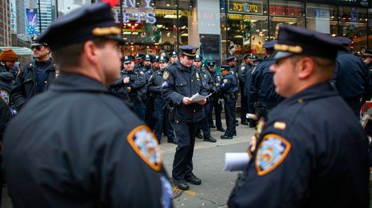
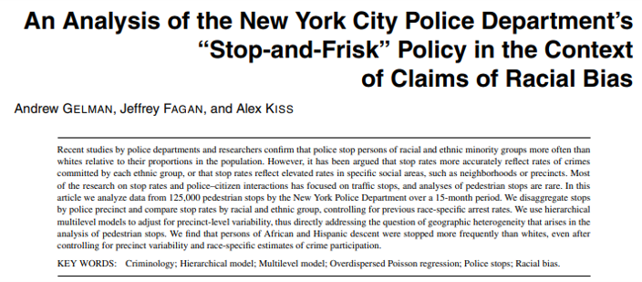

```{r setup, include=FALSE}
# R options
options(
  htmltools.dir.version = FALSE, # for blogdown
  show.signif.stars = FALSE,     # for regression output
  warm = 1
  )
# Set dpi and height for images
library(knitr)
# ggplot2 color palette with gray
color_palette <- list(gray = "#999999", 
                      salmon = "#E69F00", 
                      lightblue = "#56B4E9", 
                      green = "#009E73", 
                      yellow = "#F0E442", 
                      darkblue = "#0072B2", 
                      red = "#D55E00", 
                      purple = "#CC79A7")

options(htmltools.dir.version = FALSE)
knitr::opts_chunk$set(
	fig.align = "center",
	fig.height = 3.75,
	fig.width = 6.25,
	message = FALSE,
	warning = FALSE
)
```

```{r echo=FALSE, message=FALSE, warning=FALSE}
library(tidyverse)
library(knitr)
```

### A quick survey

https://duke.qualtrics.com/jfe/form/SV_cBmbywxmqDYyvhI

---

### Stop-question-frisk

```{r, out.width = "60%", eval=TRUE, echo=FALSE, warning = F, message = F}
 
```

.small[Photo - Adapted from Kena Betancur, Agence France-Presse/Getty Images]

- Police protocol intended to reduce crime by stopping, questioning, and 
searching civilians
- Instituted in early 2000s, peaking in 2011 with almost 700,000 stops
- Fraught with controversy - many assert unfair targeting of Black and Hispanic
citizens

---

### Stop-question-frisk

```{r, eval=TRUE, echo=FALSE, warning = F, message = F, out.width = "70%"}

```

- Gelman, Fagan, and Kiss (JASA, 2007) found evidence of racial disparities,
even after adjusting for potential confounders
- A 2013 class-action lawsuit determined SQF was being used unconstitutionally; 
number of events fell sharply, with only around 10,000 stops per year from 
2016 onwards

---

### Writing a model

```{r, echo = F, message = F, warning = F}
sqf <- read.csv("data/sqf_cleaned.csv")
sqf <- sqf %>% 
  filter(weapon_found != "(",
         suspect_age != "(null)") %>% 
  mutate(any_weapon = ifelse(weapon_found == "Y", 1, 0),  
         black_hisp = case_when(suspect_race == "BLACK" ~ "black",
                                suspect_race == "BLACK HISPANIC" ~ "blackhisp",
                                !(suspect_race %in% c("BLACK", "BLACK HISPANIC")) ~ "nonblackhisp"),
         build_clean = case_when(suspect_build == "H" ~ "HEA",
                                 suspect_build == "M" ~ "MED",
                                 suspect_build == "T" ~ "THN",
                                 suspect_build %in% c("(nu", "(null)", "U", "XXX") ~ "OTHER",
                                 TRUE ~ as.character(suspect_build)))
sqf$suspect_age <- as.numeric(paste(sqf$suspect_age))

m1 <- lm(stop_duration_min ~ suspect_age + any_weapon + build_clean, data = sqf)
```

```{r, eval = F}
# Note: you'll have to do the data cleaning yourself...
# Keep it clear and reproducible!

sqf <- read_csv("dat/sqf_cleaned.csv")

```

```{r}
table(sqf$build_clean)
table(sqf$any_weapon)
```

---

### Writing a model

```{r}
summary(sqf$stop_duration_min)
summary(sqf$suspect_age)
```

---

### Writing a model

.question[
Let's ignore model assumption issues and diagnostics for now. Suppose you wanted
to create a linear model that related the stop duration of an SQF event to the
build of the suspect, whether they had a weapon on their person, and their age.
How would you express such a model mathematically?
]

---

### What could go wrong?

.question[
What issue(s) do you see with the model below? (Again, ignore issues of whether
the model itself is appropriate; assume we just want a linear model relating
the outcome of stop duration to the three predictors)
]

\begin{align*}
duration = build + weapon + age
\end{align*}

---

### What could go wrong?

.question[
How about here?
]

\begin{align*}
duration = \beta_1 build + \beta_2 weapon + \beta_3 age
\end{align*}

---

### What could go wrong?

.question[
Or here?
]

\begin{align*}
duration &= \beta_1 I(build = HEA) + \beta_2 I(build = MED) + \\
&\mathrel{\phantom{=}} \beta_3 I(build = OTHER) + \beta_4 weapon + \\
&\mathrel{\phantom{=}} \beta_5 age
\end{align*}

---

### What could go wrong?

.question[
Are we finished?
]

\begin{align*}
duration_i &= \beta_0 + \beta_1 I(build_i = HEA) + \beta_2 I(build_i = MED) + \\
&\mathrel{\phantom{=}} \beta_3 I(build_i = OTHER) + \beta_4 weapon_i + \\ 
&\mathrel{\phantom{=}} \beta_5 age_i
\end{align*}

---

### What could go wrong?

.question[
What are the parameters in the model written below? How can we write it 
succintly in matrix notation?
]

\begin{align*}
duration_i &= \beta_0 + \beta_1 I(build_i = HEA) + \beta_2 I(build_i = MED) + \\
&\mathrel{\phantom{=}} \beta_3 I(build_i = OTHER) + \beta_4 weapon_i + \\ 
&\mathrel{\phantom{=}} \beta_5 age_i + \epsilon_i
\end{align*}

where

\begin{align*}
\epsilon_i \stackrel{i.i.d.}{\sim} N(0, \sigma^2)
\end{align*}

---

### Another model

.question[
Say instead of duration being the outcome variable, suppose we're interested in
the log-odds of having a "long" SQF event (an event lasting over half an hour). 
If we fit a logistic regression model for this question, what would our model 
look like?
]

```{r}
sqf %>% 
  mutate(long_sqf = ifelse(stop_duration_min > 30, 1, 0)) %>% 
  count(long_sqf)
```

---

### A Bayesian model

.question[
Let's return to our original OLS model. Suppose we wanted to fit a Bayesian
linear regression model. How would you formulate it? What priors on the 
parameters might make sense?
]

---

### References

[1] Stop, Question, and Frisk Data, 2003 - 2019. Accessed on NYPD website.

[2] Gelman A, Fagan J, Kiss A (2012). "Stop-and-frisk policy in the context of 
claims of racial bias." Journal of the American Statistical Association. 
102(479): 813 - 823.

[3] Floyd, et al. v. City of New York, et al. United States District Court for
the Southern District of New York. 959 F. Supp. 2d 540 (2013).

[4] Mummolo, J (2018). "Modern Police Tactics, Police-Citizen Interactions, and 
the Prospects for Reform". The Journal of Politics. 80: 1–15.