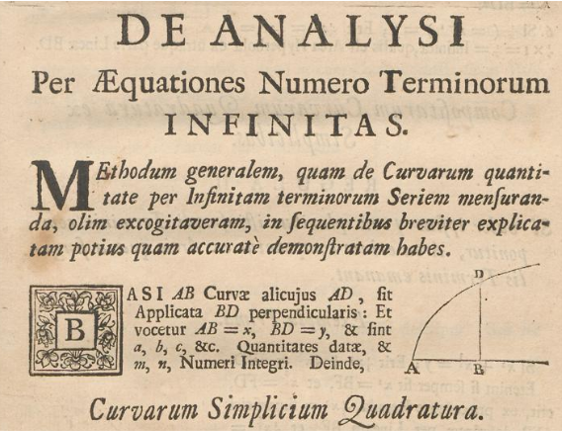

```{r setup, include=FALSE}
# R options
options(
  htmltools.dir.version = FALSE, # for blogdown
  show.signif.stars = FALSE,     # for regression output
  warm = 1
  )
# Set dpi and height for images
library(knitr)
# ggplot2 color palette with gray
color_palette <- list(gray = "#999999", 
                      salmon = "#E69F00", 
                      lightblue = "#56B4E9", 
                      green = "#009E73", 
                      yellow = "#F0E442", 
                      darkblue = "#0072B2", 
                      red = "#D55E00", 
                      purple = "#CC79A7")

options(htmltools.dir.version = FALSE)
knitr::opts_chunk$set(
	fig.align = "center",
	fig.height = 3.75,
	fig.width = 6.25,
	message = FALSE,
	warning = FALSE
)
```

```{r echo=FALSE, message=FALSE, warning=FALSE}
library(tidyverse)
```

### Estimating bike crashes in NC counties

```{r, eval=TRUE, echo=FALSE, warning = F, message = F, out.width = "100%"}
library(knitr)
include_graphics("img/bike_crash.jpg")
```
<!-- .center[Image credit: Petar Milošević, [CC BY-SA 4.0](https://creativecommons.org/licenses/by-sa/4.0), via Wikimedia Commons] -->

---

### Data

```{r, echo = F}
bike <- read_csv("data/bikecrash.csv")
bike %>% 
  select(county, crashes)
```
Suppose we thought these crashes came from a Poisson distribution. 
.question[
How might we estimate the parameter of that Poisson distribution, given our
observed data?
]

---
  
<!-- ### Maximum likelihood estimation -->

<!-- If $Y \sim Pois(\lambda)$, then -->

<!-- \begin{align*} -->
<!--   P(Y = y) = \frac{\lambda^y e^{-\lambda}}{y!} -->
<!-- \end{align*} -->

<!-- .question[ -->
<!-- If $Y_1, Y_2, \cdots, Y_n$ are each i.i.d. distributed with $Pois(\lambda)$, -->
<!-- then what is the **Maximum Likelihood Estimate** (MLE) of $\lambda$? -->

### Maximum likelihood estimation

We can maximize the .vocab[likelihood function]. Assuming the observations are
i.i.d., in general we have:

\begin{align*}
\mathcal{L}(\lambda | Y) &= f(y_1, y_2, \cdots, y_n | \lambda)\\
&= f(y_1 | \lambda)f(y_2 | \lambda) \cdots f(y_n | \lambda)\\
&= \prod\limits^{n}_{i = 1} f(y_i | \lambda).
\end{align*}

The likelihood function is the probability of "seeing our observed data," 
**given** a value of $\lambda$. Do not get $f(y_i | \lambda)$ confused with 
$f(\lambda | y_i)$!

.question[
If $Y_1, Y_2, \cdots, Y_n$ are each i.i.d. distributed with $Pois(\lambda)$,
then what is the .vocab[Maximum Likelihood Estimate] (MLE) of $\lambda$?
]

---

### Maximum likelihood estimation

For our Poisson example, we thus have:

\begin{align*}
\mathcal{L}(\lambda | Y) &= \prod\limits^{n}_{i = 1} f(y_i | \lambda)\\
&= \prod\limits_{i = 1}^n \frac{\lambda^y_i e^{-\lambda}}{y_i!}\\
\log \mathcal{L}(\lambda | Y) &= \sum_{i = 1}^n \left( y_i\log \lambda - \lambda - \log y_i! \right)\\
&= \log \lambda \sum_{i = 1}^n y_i - n\lambda - \sum_{i = 1}^n \log y_i!
\end{align*}

.question[
Why do we maximize the log-likelihood function here?
]

---

### Maximum likelihood estimation

Setting the .vocab[score function] equal to 0:

\begin{align*}
\frac{\partial}{\partial\lambda}\log \mathcal{L}(\lambda | Y) = \frac{1}{\lambda}\sum_{i = 1}^n y_i - n &\stackrel{set}{=} 0\\
\implies \hat{\lambda} = \frac{1}{n}\sum_{i = 1}^n y_i,
\end{align*}

as expected. Next, let's verify that $\hat{\lambda}$ is indeed a maximum:

\begin{align*}
\frac{\partial^2}{\partial\lambda^2}\log \mathcal{L}(\lambda | Y) &= -\frac{1}{\lambda^2}\sum_{i = 1}^n y_i - n\\
&< 0.
\end{align*}

---

### Can we do better?

```{r echo = F}
bike
```

We might expect that more populous, more urban counties might have more crashes.
There might also be a relationship with traffic volume. 

.quesiton[
Can we incorporate this additional information while accounting for potential
confounding?
]

---

### Poisson regression

\begin{align*}
\log\large(\underbrace{E(Y | \mathbf{X}}_{\lambda})\large) = \beta_0 + \mathbf{X}^T\boldsymbol\beta
\end{align*}

.vocab[Generalized linear model] often used for count (or rate) data
- Assumes outcome has Poisson distribution
- Canonical link: log of conditional expectation of response has linear 
relationship with predictors

.question[
Can we differentiate the (log) likelihood function, set it equal to zero, and
solve for the MLEs for $\boldsymbol\beta = (\beta_0, \beta_1, \cdots, \beta_p)$
as before?
]

---

### Poisson regression

\begin{align*}
\log \mathcal{L}&= \sum_{i = 1}^n \left( y_i\log \lambda - \lambda - \log y_i! \right)\\
&= \sum_{i = 1}^n y_i\mathbf{X}_i\boldsymbol\beta - e^{\mathbf{X}_i\boldsymbol\beta} - \log y_i!
\end{align*}

We would like to solve the equations

\begin{align*}
\left(\frac{\partial \log \mathcal{L}}{\partial \beta_j}\right) \stackrel{set}{=} \mathbf{0},
\end{align*}

but there is no closed-form solution, as this is a transcendental equation in 
the parameters of interest.

.question[
How might we solve these equations numerically?
]

---

### A one-dimensional problem

Suppose you're trying to find the maximum of the following function:

\begin{align*}
f(x) = \frac{x + \log(x)}{2^x}
\end{align*}

Let's try differentiating, setting equal to 0, and solving:

\begin{align*}
\frac{d}{dx}f(x) = 2^{-x}\left(1 + \frac{1}{x} - \log(2)(x + \log(x)) \right).
\end{align*}

We run into a similar problem: we cannot algebraically solve for the root of 
this equation.

---

### A one-dimensional problem

```{r, echo = F, fig.height = 5.5, fig.width = 10}
func <- function(x){
  (x + log(x))/(2^x)
}

func2 <- function(x){
  2^(-1 * x) * (1 + 1/x - log(2) * (x + log(x)))
}

par(mfrow = c(1, 2))
plot(func, from = 0, to = 5, ylab = "", xlab = "", xlim = c(0, 4), main = "Original function")
plot(func2, from = 0, to = 5, ylab = "", xlab = "", xlim = c(0, 4), ylim = c(-0.5, 5), main = "First derivative")
abline(h = 0, col = "gray")
```

.question[
It looks lke the maximum is a bit shy of 2 (trust me on this one, it's a global
maximum). How might we find where it is?
]

---

### A one-dimensional problem

```{r, eval=TRUE, echo=FALSE, warning = F, message = F, out.width = "80%"}

```

---

### A one-dimensional problem

.vocab[Newton-Raphson] algorithm for root finding is based on second-order Taylor 
approximation around true root:

- Start with initial guess $\theta^{(0)}$
- Iterate $\theta^{(t + 1)} = \theta^{(t)} - \frac{f^\prime(\theta^{(t)})}{f^{\prime\prime} (\theta^{(t)})}$
- Stop when convergence criterion is satisfied

Although it requires explicit forms of first two derivatives, the convergence
speed is quite fast. 

There are some necessary conditions for convergence, but this is beyond the
scope of STA 440. Many likelihood functions you are likely to encounter (e.g., 
GLMs with canonical link) will in fact converge from any starting value.

---

### A one-dimensional problem

```{r, echo = F, fig.height = 7, fig.width = 11}
library(animation)
nr  <- function (FUN = function(x) x^2 - 4, init = 10, rg = c(-1, 10), 
    tol = 0.001, interact = FALSE, col.lp = c("blue", "red", 
        "red"), main, xlab, ylab, ...) 
{
    if (interact) {
        curve(FUN, min(rg), max(rg), xlab = "x", ylab = eval(substitute(expression(f(x) == 
            y), list(y = body(FUN)))), main = "Locate the starting point")
        init = unlist(locator(1))[1]
    }
    i = 1
    nms = names(formals(FUN))
    grad = deriv(as.expression(body(FUN)), nms, function.arg = TRUE)
    x = c(init, init - FUN(init)/attr(grad(init), "gradient"))
    gap = FUN(x[2])
    if (missing(xlab)) 
        xlab = nms
    if (missing(ylab)) 
        ylab = eval(substitute(expression(f(x) == y), list(y = body(FUN))))
    if (missing(main)) 
        main = eval(substitute(expression("Root-finding by Newton-Raphson Method:" ~ 
            y == 0), list(y = body(FUN))))
    nmax = ani.options("nmax")
    while (abs(gap) > tol & i <= nmax & !is.na(x[i + 1])) {
        dev.hold()
        curve(FUN, min(rg), max(rg), main = main, xlab = xlab, 
            ylab = ylab, ...)
        abline(h = 0, col = "gray")
        segments(x[1:i], rep(0, i), x[1:i], FUN(x[1:i]), col = col.lp[1])
        segments(x[1:i], FUN(x[1:i]), x[2:(i + 1)], rep(0, i), 
            col = col.lp[2])
        points(x, rep(0, i + 1), col = col.lp[3])
        points(x[1:i], FUN(x[1:i]), col = col.lp[3])
        mtext(paste("t = ", i, ": Current root: ", round(x[i + 1], 3), sep = ""), 3)
        gap = FUN(x[i + 1])
        x = c(x, x[i + 1] - FUN(x[i + 1])/attr(grad(x[i + 1]), 
            "gradient"))
        ani.pause()
        i = i + 1
    }
    rtx = par("usr")[4]
#    arrows(x[i], rtx, x[i], 0, col = "gray")
    invisible(list(root = x[i], value = gap, iter = i - 1))
}

par(mfrow = c(2, 3))
nr(function(x) 2^(-1 * x) * (1 + 1/x - log(2) * (x + log(x))), 0.3, c(0, 4),
   main = "", xlab = "", ylab = "", ylim = c(-0.5, 5))
```

---

### A one-dimensional problem

\begin{align*}
f(x) &= \frac{x + \log(x)}{2^x} \\
\frac{d}{dx}f(x) &= 2^{-x}\left(1 + \frac{1}{x} - \log(2)(x + \log(x)) \right).
\end{align*}

```{r}
testing <- function(x){
  2^(-1 * x) * (1 + 1/x - log(2) * (x + log(x)))
}

testing(1.729)
```

That's pretty good (only six steps from starting guess of 0.3)!

---

### Newton-Raphson in higher dimensions

.vocab[Score vector] and .vocab[Hessian] for $\log \mathcal{L}(\boldsymbol\theta | \mathbf{X})$ with $\boldsymbol\theta = (\theta_1, \cdots, \theta_p)^T$:

$$\nabla \log \mathcal{L} = \begin{pmatrix}
\frac{\partial \log \mathcal{L}}{\partial \boldsymbol\theta_1}\\
\vdots\\
\frac{\partial \log \mathcal{L}}{\partial \boldsymbol\theta_p}
\end{pmatrix}$$
$$\nabla^2 \log \mathcal{L} = \begin{pmatrix}
\frac{\partial^2 \log\mathcal{L}}{\partial \theta_1^2} & \frac{\partial^2 \log\mathcal{L}}{\partial \theta_1 \theta_2} & \cdots & \frac{\partial^2 \log\mathcal{L}}{\partial \theta_1\theta_p}\\
\frac{\partial^2 \log\mathcal{L}}{\partial \theta_2\theta_1} & \frac{\partial^2 \log\mathcal{L}}{\partial \theta_2^2} & \cdots & \frac{\partial^2 \log\mathcal{L}}{\partial \theta_2\theta_p} \\
\vdots & \vdots & \ddots & \vdots \\
\frac{\partial^2 \log\mathcal{L}}{\partial \theta_p\theta_1} & \frac{\partial^2 \log\mathcal{L}}{\partial \theta_p\theta_2} & \cdots & \frac{\partial^2 \log\mathcal{L}}{\partial \theta_p^2}
\end{pmatrix}$$
 
---

### Newton-Raphson in higher dimensions

We can modify the Newton-Raphson algorithm for higher dimensions: 

- Start with initial guess $\boldsymbol\theta ^{(0)}$
- Iterate $\boldsymbol\theta^{(t + 1)} = \boldsymbol\theta^{(t)} - \left(\nabla^2\log\mathcal{L}(\boldsymbol\theta^{(t)} | \mathbf{X}) \right)^{-1} \left( \nabla \log\mathcal{L}(\boldsymbol\theta^{(t)} | \mathbf{X}) \right)$
- Stop when convergence criterion is satisfied

Under certain conditions, a global maximum exists; this again is guaranteed for 
many common applications. 

Computing the Hessian can be computationally demanding (and annoying), but there 
are ways around it in practice. 

---

### Poisson regression

\begin{align*}
\log \mathcal{L}&= \sum_{i = 1}^n y_i\mathbf{X}_i\boldsymbol\beta - e^{\mathbf{X}_i\boldsymbol\beta} - \log y_i!
\end{align*}

.question[
What are the score vector and Hessian corresponding to the Poisson regression
log-likelihood? What would the Newton-Raphson update steps be?
]

---

### Poisson regression

\begin{align*}
\log \mathcal{L}&= \sum_{i = 1}^n y_i\mathbf{X}_i\boldsymbol\beta - e^{\mathbf{X}_i\boldsymbol\beta} - \log y_i!\\
\nabla \log \mathcal{L}&= \sum_{i = 1}^n \left(y_i - e^{\mathbf{X}_i\boldsymbol\beta}\right)\mathbf{X}_i^T\\
\nabla^2 \log \mathcal{L} &= -\sum_{i = 1}^n e^{\mathbf{X}_i\boldsymbol\beta}\mathbf{X}_i\mathbf{X}_i^T
\end{align*}

Newton-Raphson update steps for Poisson regression: 

\begin{align*}
\boldsymbol\beta^{(t+1)} &= \boldsymbol\beta^{(t)} - \left(-\sum_{i = 1}^n e^{\mathbf{X}_i\boldsymbol\beta}\mathbf{X}_i\mathbf{X}_i^T \right)^{-1}\left(\sum_{i = 1}^n \left(y_i - e^{\mathbf{X}_i\boldsymbol\beta}\right)\mathbf{X}_i^T \right)
\end{align*}

---

### Poisson regression

Newton-Raphson update steps for Poisson regression: 

\begin{align*}
\boldsymbol\beta^{(t+1)} &= \boldsymbol\beta^{(t)} - \left(-\sum_{i = 1}^n e^{\mathbf{X}_i\boldsymbol\beta}\mathbf{X}_i\mathbf{X}_i^T \right)^{-1}\left(\sum_{i = 1}^n \left(y_i - e^{\mathbf{X}_i\boldsymbol\beta}\right)\mathbf{X}_i^T \right)
\end{align*}

.question[
Can you implement this in R?
]