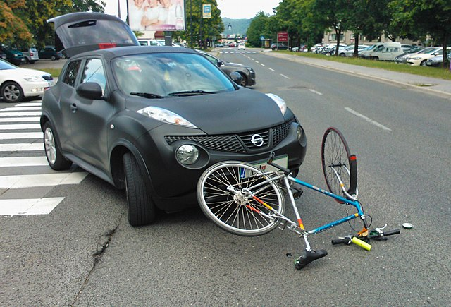
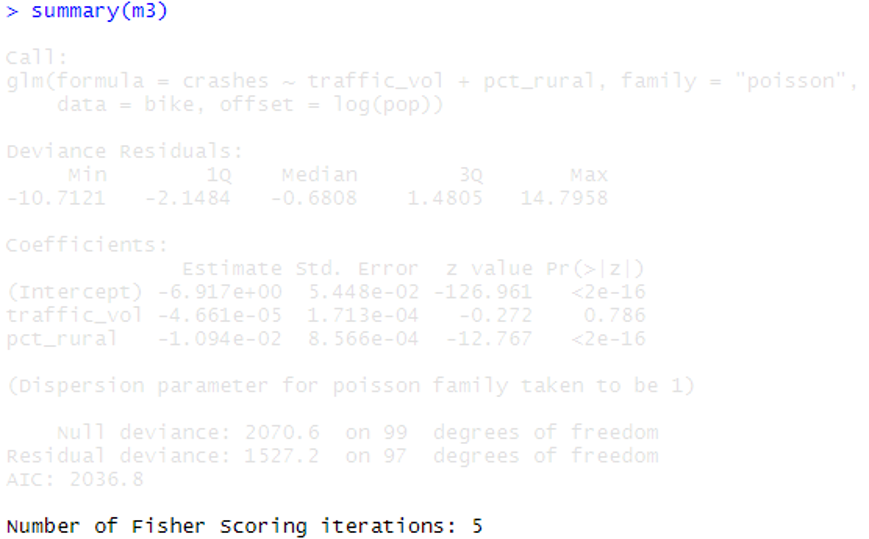

```{r setup, include=FALSE}
# R options
options(
  htmltools.dir.version = FALSE, # for blogdown
  show.signif.stars = FALSE,     # for regression output
  warm = 1
  )
# Set dpi and height for images
library(knitr)
# ggplot2 color palette with gray
color_palette <- list(gray = "#999999", 
                      salmon = "#E69F00", 
                      lightblue = "#56B4E9", 
                      green = "#009E73", 
                      yellow = "#F0E442", 
                      darkblue = "#0072B2", 
                      red = "#D55E00", 
                      purple = "#CC79A7")

options(htmltools.dir.version = FALSE)
knitr::opts_chunk$set(
	fig.align = "center",
	fig.height = 3.75,
	fig.width = 6.25,
	message = FALSE,
	warning = FALSE
)
```

```{r echo=FALSE, message=FALSE, warning=FALSE}
library(tidyverse)
```

### Estimating bike crashes in NC counties

```{r, eval=TRUE, echo=FALSE, warning = F, message = F, out.width = "100%"}
library(knitr)

```
<!-- .center[Image credit: Petar Milošević, [CC BY-SA 4.0](https://creativecommons.org/licenses/by-sa/4.0), via Wikimedia Commons] -->

```{r, echo = F}
bike <- read_csv("data/bikecrash.csv")
```

---
  
### Newton-Raphson in higher dimensions

.vocab[Score vector] and .vocab[Hessian] for $\log \mathcal{L}(\boldsymbol\theta | \mathbf{X})$ with $\boldsymbol\theta = (\theta_1, \cdots, \theta_p)^T$:

$$\nabla \log \mathcal{L} = \begin{pmatrix}
\frac{\partial \log \mathcal{L}}{\partial \boldsymbol\theta_1}\\
\vdots\\
\frac{\partial \log \mathcal{L}}{\partial \boldsymbol\theta_p}
\end{pmatrix}$$
$$\nabla^2 \log \mathcal{L} = \begin{pmatrix}
\frac{\partial^2 \log\mathcal{L}}{\partial \theta_1^2} & \frac{\partial^2 \log\mathcal{L}}{\partial \theta_1 \theta_2} & \cdots & \frac{\partial^2 \log\mathcal{L}}{\partial \theta_1\theta_p}\\
\frac{\partial^2 \log\mathcal{L}}{\partial \theta_2\theta_1} & \frac{\partial^2 \log\mathcal{L}}{\partial \theta_2^2} & \cdots & \frac{\partial^2 \log\mathcal{L}}{\partial \theta_2\theta_p} \\
\vdots & \vdots & \ddots & \vdots \\
\frac{\partial^2 \log\mathcal{L}}{\partial \theta_p\theta_1} & \frac{\partial^2 \log\mathcal{L}}{\partial \theta_p\theta_2} & \cdots & \frac{\partial^2 \log\mathcal{L}}{\partial \theta_p^2}
\end{pmatrix}$$
 
---

### Newton-Raphson in higher dimensions

We can modify the Newton-Raphson algorithm for higher dimensions: 

- Start with initial guess $\boldsymbol\theta ^{(0)}$
- Iterate $\boldsymbol\theta^{(t + 1)} = \boldsymbol\theta^{(t)} - \left(\nabla^2\log\mathcal{L}(\boldsymbol\theta^{(t)} | \mathbf{X}) \right)^{-1} \left( \nabla \log\mathcal{L}(\boldsymbol\theta^{(t)} | \mathbf{X}) \right)$
- Stop when convergence criterion is satisfied

Under certain conditions, a global maximum exists; this again is guaranteed for 
many common applications. 

Computing the Hessian can be computationally demanding (and annoying), but there 
are ways around it in practice. 

---

### Poisson regression

\begin{align*}
\log \mathcal{L}&= \sum_{i = 1}^n y_i\mathbf{X}_i\boldsymbol\beta - e^{\mathbf{X}_i\boldsymbol\beta} - \log y_i!\\
\nabla \log \mathcal{L}&= \sum_{i = 1}^n \left(y_i - e^{\mathbf{X}_i\boldsymbol\beta}\right)\mathbf{X}_i^T\\
\nabla^2 \log \mathcal{L} &= -\sum_{i = 1}^n e^{\mathbf{X}_i\boldsymbol\beta}\mathbf{X}_i\mathbf{X}_i^T
\end{align*}

Newton-Raphson update steps for Poisson regression: 

\begin{align*}
\boldsymbol\beta^{(t+1)} &= \boldsymbol\beta^{(t)} - \left(-\sum_{i = 1}^n e^{\mathbf{X}_i\boldsymbol\beta}\mathbf{X}_i\mathbf{X}_i^T \right)^{-1}\left(\sum_{i = 1}^n \left(y_i - e^{\mathbf{X}_i\boldsymbol\beta}\right)\mathbf{X}_i^T \right)
\end{align*}

---

### Back to bike crashes

```{r echo = F}
bike
```

- `pop`: county population
- `med_hh_income`: median household income in thousands
- `traffic_vol`: mean traffic volume per meter of major roadways
- `pct_rural`: percentage of county population living in rural area

---

### Back to bike crashes

Let's fit a model with `traffic_vol` and `pct_rural` for now:

```{r}
m1 <- glm(crashes ~ traffic_vol + pct_rural, 
          data = bike, family = "poisson")

round(summary(m1)$coef, 6)
```

.question[
What might we conclude / interpret from this model?
]

---

### Newton-Raphson (rough) implementation

Newton-Raphson update steps for Poisson regression: 

\begin{align*}
\boldsymbol\beta^{(t+1)} &= \boldsymbol\beta^{(t)} - \left(-\sum_{i = 1}^n e^{\mathbf{X}_i\boldsymbol\beta}\mathbf{X}_i\mathbf{X}_i^T \right)^{-1}\left(\sum_{i = 1}^n \left(y_i - e^{\mathbf{X}_i\boldsymbol\beta}\right)\mathbf{X}_i^T \right)
\end{align*}

Function for score vector, given vector `beta`, matrix `X`, and vector 
`y`:

```{r}
d1func <- function(beta, X, y){
  d1 <- rep(0, length(beta))
  for(i in 1:length(y)){
    d1 <- d1 + (y[i] - exp(X[i,] %*% beta)) %*% X[i,]
  }
  return(colSums(d1))
}
```

---

### Newton-Raphson (rough) implementation

Newton-Raphson update steps for Poisson regression: 

\begin{align*}
\boldsymbol\beta^{(t+1)} &= \boldsymbol\beta^{(t)} - \left(-\sum_{i = 1}^n e^{\mathbf{X}_i\boldsymbol\beta}\mathbf{X}_i\mathbf{X}_i^T \right)^{-1}\left(\sum_{i = 1}^n \left(y_i - e^{\mathbf{X}_i\boldsymbol\beta}\right)\mathbf{X}_i^T \right)
\end{align*}

Function for Hessian, given vector `beta`, matrix `X`, and vector 
`y`:

```{r}
d2func <- function(beta, X, y){
  d2 <- matrix(0, nrow = length(beta), ncol = length(beta))
  for(i in 1:length(y)){
    d2 <- d2 - t((exp(X[i,] %*% beta)) %*% X[i,]) %*% (X[i,])
  }
  return(d2)
}
```

---

### Newton-Raphson (rough) implementation

Some bookkeeping: 

```{r}
beta <- c(mean(log(bike$crashes)), 0, 0)
X <- cbind(1, bike$traffic_vol, bike$pct_rural)
y <- bike$crashes
iter <- 1
delta <- 1

temp <- matrix(0, nrow = 500, ncol = 3)
```

---

### Newton-Raphson (rough) implementation

Actual Newton-Raphson implementation:

\begin{align*}
\boldsymbol\beta^{(t+1)} &= \boldsymbol\beta^{(t)} - \left(-\sum_{i = 1}^n e^{\mathbf{X}_i\boldsymbol\beta}\mathbf{X}_i\mathbf{X}_i^T \right)^{-1}\left(\sum_{i = 1}^n \left(y_i - e^{\mathbf{X}_i\boldsymbol\beta}\right)\mathbf{X}_i^T \right)
\end{align*}

```{r}
while(delta > 0.000001 & iter < 500){
  old <- beta
  beta <- old - solve(d2func(beta = beta, X = X, y = y)) %*% 
                d1func(beta = beta, X = X, y = y)
  temp[iter,] <- beta
  
  delta <- sqrt(sum((beta - old)^2))
  iter <- iter + 1
}
```

---

### Newton-Raphson (rough) implementation

```{r}
iter
delta
beta

m1$coefficients
```

---

### Back to bike crashes

```{r, echo = F}
library(sf)
nc <- st_read(system.file("shape/nc.shp", package = "sf"), quiet = TRUE)
names(nc)[5] <- "county"
nc <- merge(nc, bike, by = "county")
par(mfrow = c(2, 1))
ggplot(data = nc) +
  geom_sf(aes(fill = pop/1000)) +
  scale_fill_gradient(low = "#fee8c8", high ="#7f0000") +
  theme_void() + 
  theme(legend.position = "bottom",
        plot.title = element_text(hjust = 0.5)) + 
  labs(fill = "",
       title = "County population (in thousands)")
ggplot(data = nc) +
  geom_sf(aes(fill = crashes)) +
  scale_fill_gradient(low = "#fee8c8", high ="#7f0000") +
  theme_void() + 
  theme(legend.position = "bottom",
        plot.title = element_text(hjust = 0.5)) + 
  labs(fill = "",
       title = "Number of bike crashes")
```

---

### Back to bike crashes

\begin{align*}
\log\left(E(Y | \mathbf{X})\right) &= \beta_0 + \beta_1(pop) + \beta_2(traffic) + \beta_3(rural)\\
\end{align*}
```{r}
m2 <- glm(crashes ~ traffic_vol + pct_rural + pop, 
          data = bike, family = "poisson")
```

\begin{align*}
\log\left( \frac{E(Y | \mathbf{X})}{pop} \right) &= \beta_0 + \beta_1(traffic) + \beta_2(rural)
\end{align*}
```{r}
m3 <- glm(crashes ~ traffic_vol + pct_rural, offset = log(pop),
          data = bike, family = "poisson")
```

.question[
What are the differences in the two models above?
]

---

### Back to bike crashes

\begin{align*}
\log\left( \frac{E(Y | \mathbf{X})}{pop} \right) &= \beta_0 + \beta_1(traffic) + \beta_2(rural) \\
\log\left(E(Y | \mathbf{X})\right) &=  \beta_0 + \beta_1(traffic) + \beta_2(rural) + \log(pop)
\end{align*}

Here, we are using `pop` as an .vocab[offset]. This means that our dependent 
variable is actually a *rate*, even though we are providing counts, and we can
look at covariate effects directly on this rate.

If we use `pop` as a covariate, then the response is no longer a rate of bike
crashes per unit population. However, we would be able to assess association
between population and number of bike crashes (conditionally on traffic volume
and urbanicity).

---

### Back to bike crashes

```{r}
round(summary(m1)$coef, 6)
round(summary(m2)$coef, 6)
round(summary(m3)$coef, 6)
```

---

### Poisson regression with offset

.question[
Can we simply use `bike$crashes/bike$pop` as our outcome variable in the
code we've already written?
]

```{r}
beta <- c(mean(log(bike$crashes)), 0, 0)
X <- cbind(1, bike$traffic_vol, bike$pct_rural)
y <- bike$crashes / bike$pop
iter <- 1
delta <- 1

temp <- matrix(0, nrow = 500, ncol = 3)

while(delta > 0.000001 & iter < 500){
  old <- beta
  beta <- old - solve(d2func(beta = beta, X = X, y = y)) %*% 
                d1func(beta = beta, X = X, y = y)
  temp[iter,] <- beta
  
  delta <- sqrt(sum((beta - old)^2))
  iter <- iter + 1
}
```

---

### Poisson regression with offset

```{r}
round(beta, 6)

round(m3$coefficients, 6)
```

.question[
They're close, but not quite right. Did something go wrong?
]

---

### Poisson regression with offset

```{r}
m3_wrong <- m2 <- glm(crashes/pop ~ traffic_vol + pct_rural, 
          data = bike, family = "poisson")

round(m3_wrong$coefficients, 6)

round(beta, 6)
```

.question[
What's happening? (keep in mind, all output on this page is **wrong**)
]

---

### Poisson regression with offset

Let's denote an offset term by $\omega$. If we directly use `crashes/pop` in 
our Poisson regression likelihood, we would have a log-likelihood along the 
lines of

\begin{align*}
\log \mathcal{L}&\propto \sum_{i = 1}^n \frac{y_i}{\omega_i}\mathbf{X}_i\boldsymbol\beta - e^{\mathbf{X}_i\boldsymbol\beta}
\end{align*}

This is incorrect. We cannot assume `crashes/pop` has a Poisson distribution.


---

### Poisson regression with offset

If we write the log-likelihood for a Poisson regression with offset correctly, 
we have:

\begin{align*}
\log\left(E(Y | \mathbf{X})\right) &= \beta_0 + \mathbf{X}^T\boldsymbol\beta - \log \boldsymbol\omega \\
\log \mathcal{L}&\propto \sum_{i = 1}^n y_i\mathbf{X}_i\boldsymbol\beta - \omega_i e^{\mathbf{X}_i\boldsymbol\beta}
\end{align*}

Thus, we must use this *correct* log-likelihood to determine the score vector
and Hessian for our Newton-Raphson implementation.

.question[
What is the *correct* Newton-Raphson update step for Poisson regression with
offset?
]

---

### Poisson regression with offset

If we write the log-likelihood for a Poisson regression with offset correctly, 
we have:

\begin{align*}
\log \mathcal{L}&\propto \sum_{i = 1}^n y_i\mathbf{X}_i\boldsymbol\beta - \omega_i e^{\mathbf{X}_i\boldsymbol\beta}\\
\nabla \log \mathcal{L}&= \sum_{i = 1}^n \left(y_i - \omega_ie^{\mathbf{X}_i\boldsymbol\beta}\right)\mathbf{X}_i^T\\
\nabla^2 \log \mathcal{L} &= -\sum_{i = 1}^n \omega_i e^{\mathbf{X}_i\boldsymbol\beta}\mathbf{X}_i\mathbf{X}_i^T
\end{align*}

Newton-Raphson update steps for Poisson regression with offset: 

\begin{align*}
\boldsymbol\beta^{(t+1)} &= \boldsymbol\beta^{(t)} - \left(-\sum_{i = 1}^n \omega_ie^{\mathbf{X}_i\boldsymbol\beta}\mathbf{X}_i\mathbf{X}_i^T \right)^{-1}\left(\sum_{i = 1}^n \left(y_i - \omega_i e^{\mathbf{X}_i\boldsymbol\beta}\right)\mathbf{X}_i^T \right)
\end{align*}


---

### Poisson regression with offset

Newton-Raphson update steps for Poisson regression with offset: 

\begin{align*}
\boldsymbol\beta^{(t+1)} &= \boldsymbol\beta^{(t)} - \left(-\sum_{i = 1}^n \omega_ie^{\mathbf{X}_i\boldsymbol\beta}\mathbf{X}_i\mathbf{X}_i^T \right)^{-1}\left(\sum_{i = 1}^n \left(y_i - \omega_i e^{\mathbf{X}_i\boldsymbol\beta}\right)\mathbf{X}_i^T \right)
\end{align*}

In writing code, we must now specify the offset $\omega$ in addition to the
observed data $\mathbf{X}$, $y$, and candidate $\boldsymbol\beta$s.

.question[
Write code that numerically implements Poisson regression, potentially
incorporating an offset term. Analyze the bike crash data. Do your coefficient
estimates line up?
]

---

### Poisson regression with offset

Functions for score vector and Hessian (including offset term):

```{r}
d1ofs <- function(beta, X, y, offset){
  d1 <- rep(0, length(beta))
  for(i in 1:length(y)){
    d1 <- d1 + (y[i] -  offset[i] *exp(X[i,] %*% beta)) %*% X[i,]
  }
  return(colSums(d1))
}

d2ofs <- function(beta, X, y, offset){
  d2 <- matrix(0, nrow = length(beta), ncol = length(beta))
  for(i in 1:length(y)){
    d2 <- d2 - offset[i] * t((exp(X[i,] %*% beta)) %*% X[i,]) %*% (X[i,])
  }
  return(d2)
}
```

---

### Poisson regression with offset

Implementing Newton-Raphson:

```{r}
beta <- c(mean(log(bike$crashes)), 0, 0)
X <- cbind(1, bike$traffic_vol, bike$pct_rural)
y <- bike$crashes
offset <- bike$pop
iter <- 1
delta <- 1

temp <- matrix(0, nrow = 500, ncol = 3)

while(delta > 0.000001 & iter < 500){
  old <- beta
  beta <- old - solve(d2ofs(beta = beta, X = X, y = y, offset = offset)) %*% 
                d1ofs(beta = beta, X = X, y = y, offset = offset)
  temp[iter,] <- beta
  
  delta <- sqrt(sum((beta - old)^2))
  iter <- iter + 1
}
```

---

### Poisson regression with offset

```{r}
round(beta, 6)
round(m3$coefficients, 6)
```

Our manual Newton-Raphson code lines up, as expected.

---

### Fisher Scoring

```{r, eval=TRUE, echo=FALSE, warning = F, message = F, out.width = "80%"}

```

---

### Fisher Scoring

Fisher Scoring replaces $\nabla^2 \log \mathcal{L}$ with the expected 
Fisher information:

\begin{align*}
E\Large(\left(\nabla\log\mathcal{L} \right)\left(\nabla\log\mathcal{L} \right)^T \Large),
\end{align*}

which is asymptotically equivalent to the Hessian. 

.question[
In many situations, why might Fisher Scoring be easier to implement?
]