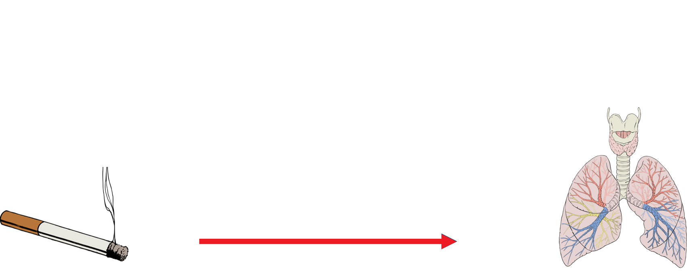
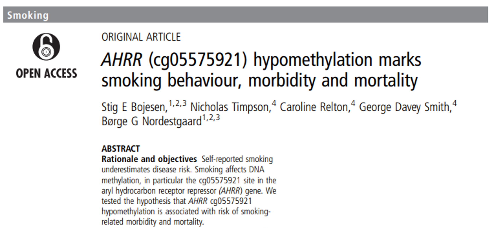
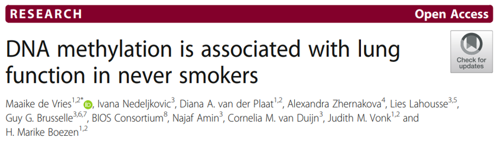
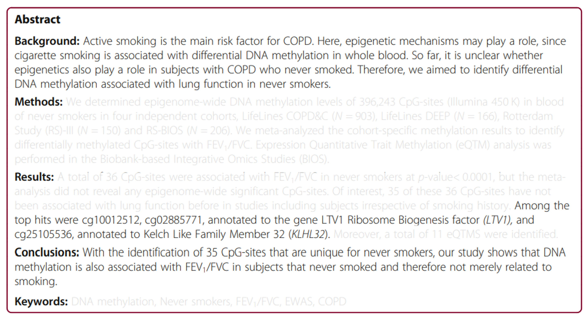
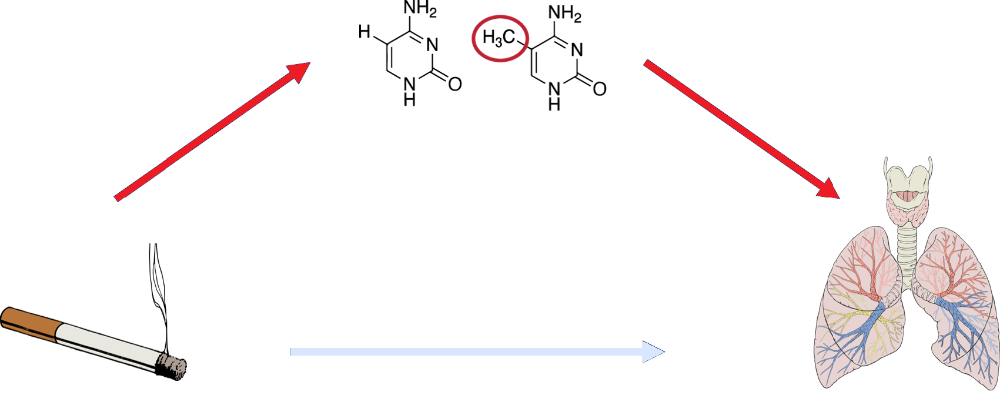
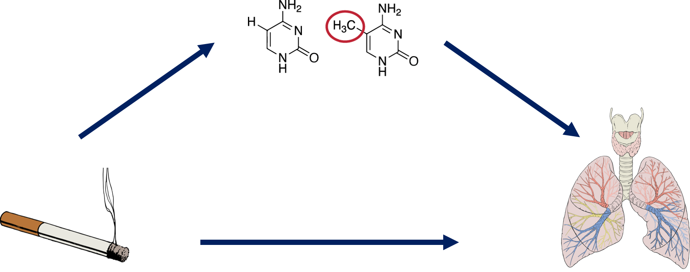
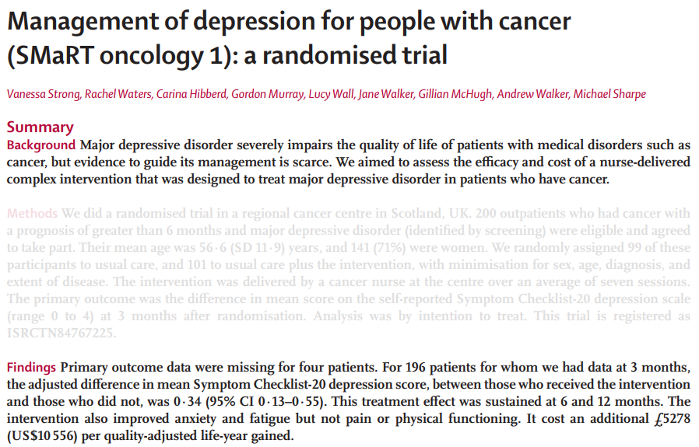
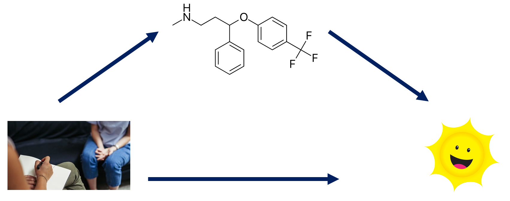
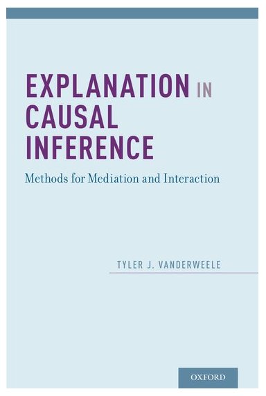
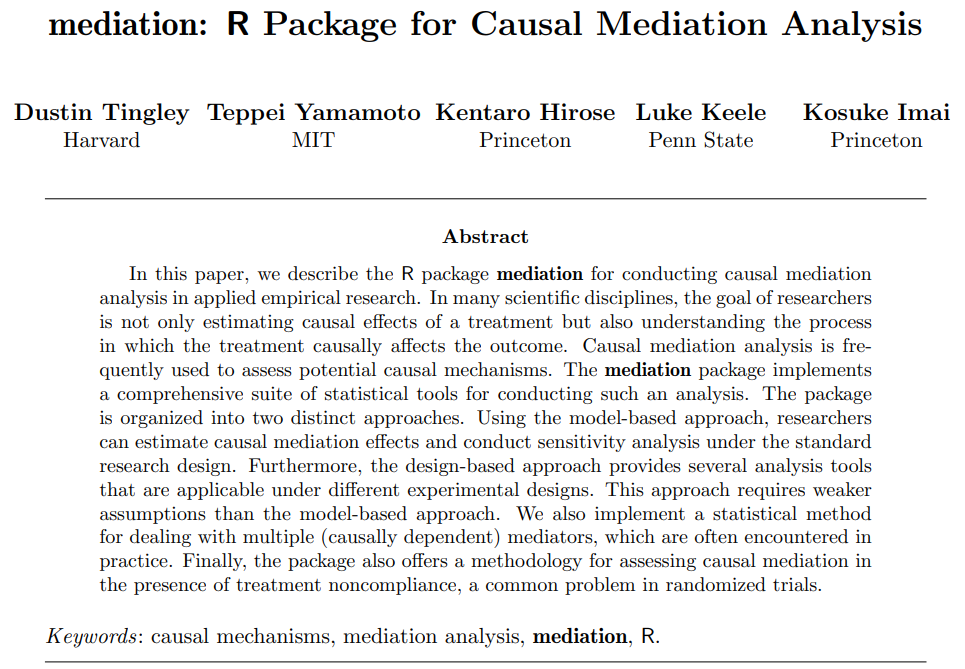

```{r setup, include=FALSE}
# R options
options(
  htmltools.dir.version = FALSE, # for blogdown
  show.signif.stars = FALSE,     # for regression output
  warm = 1
  )
# Set dpi and height for images
library(knitr)
# ggplot2 color palette with gray
color_palette <- list(gray = "#999999", 
                      salmon = "#E69F00", 
                      lightblue = "#56B4E9", 
                      green = "#009E73", 
                      yellow = "#F0E442", 
                      darkblue = "#0072B2", 
                      red = "#D55E00", 
                      purple = "#CC79A7")

options(htmltools.dir.version = FALSE)
knitr::opts_chunk$set(
	fig.align = "center",
	fig.height = 3.75,
	fig.width = 6.25,
	message = FALSE,
	warning = FALSE
)
```

```{r echo=FALSE, message=FALSE, warning=FALSE}
library(tidyverse)
library(mediation)
```

### A disclaimer

Today's seminar is an introductory surface level treatment of
mediation analysis. We focus on applications and use cases -- there are no 
theoretical results presented (even for important subjects like variance
estimation). Much of the discussion comes from VanderWeele (2016).

---

### Smoking and lung function

```{r, eval=TRUE, echo=FALSE, warning = F, message = F, out.width = "100%"}

```

---

### Smoking and DNA methylation

```{r, eval=TRUE, echo=FALSE, warning = F, message = F, out.width = "100%"}

```

---

### DNA methylation and lung function

```{r, eval=TRUE, echo=FALSE, warning = F, message = F, out.width = "100%"}

```

---

### DNA methylation and lung function

```{r, eval=TRUE, echo=FALSE, warning = F, message = F, out.width = "100%"}

```

---

### Smoking, DNA methylation and lung function?

```{r, eval=TRUE, echo=FALSE, warning = F, message = F, out.width = "100%"}

```

The "total effect of smoking on lung function"

---

### Smoking, DNA methylation and lung function?

```{r, eval=TRUE, echo=FALSE, warning = F, message = F, out.width = "100%"}

```

The "indirect effect of smoking on lung function, as mediated through DNA
methylation" (note also the "direct effect" of smoking on lung function)

---

### Smoking, DNA methylation and lung function?

```{r, eval=TRUE, echo=FALSE, warning = F, message = F, out.width = "100%"}

```

--

Mediation analysis examines the **process** by which a exposure might "impact"
an outcome - that is, a pathway examining *how* one variable might "influence"
another. We might be able to better understand biological pathways or maybe
provide evidence supporting/refuting a certain theory.

---

### Why care?

```{r, eval=TRUE, echo=FALSE, warning = F, message = F, out.width = "100%"}

```

---

### Why care?

```{r, eval=TRUE, echo=FALSE, warning = F, message = F, out.width = "100%"}

```

At 3 months in, patients receiving the CBT had higher rates of antidepressant
use. Could this be the driver for the efficacy seen later in the trial? 

--

Might we instead be able to focus on pharmacological management rather than costly 
one-on-one sessions with trained therapists?

---

### Brief detour: causal interpretation

We can interpret mediation analysis in the potential outcomes framework 
(Robins and Greenland, 1992; Pearl, 2001; VanderWeele, 2015):

- $M_{X = x}$: the value of $M$ if $X$ were (perhaps counter to fact) equal to $x$
- $Y_{X = x, M = m}$: the value of $Y$ that would have occurred if $X = x$ and
$M = x$
- $Y_{X = x, M = M_{X = x}}$: nested counterfactual of the value of $Y$ if
$X = x$ and $M$ took on its own counterfactual value if $X = x$.

--

The .vocab[total causal effect] (TCE) comparing two levels of the exposure
$X = x$ to $X = x^\star$ is:

\begin{align*}
TCE = Y_{X = x} - Y_{X = x^\star}
\end{align*}

---

### Brief detour: causal interpretation

The TCE may be decomposed as follows:

\begin{align*}
Y_{X = x} - Y(X = ^\star) &= Y_{X = x, M = M_{X = x}} - Y_{X = x^\star, M = M_{X = x^\star}}\\
&= \underbrace{\left(Y_{X = x, M = M_{X = x^\star}} - Y_{X = x^\star, M = M_{X = x^\star}}\right)}_{NDE} + \\
&\mathrel{\phantom{=}}\underbrace{\left(Y_{X = x, M = M_{X = x}} - Y_{X = x, M = M_{X = x^\star}}\right)}_{NIE}. 
\end{align*}

The .vocab[natural direct effect] (NDE) represents the difference between two
potential outcomes differing in the counterfactual value of the exposure, but 
where the value of the mediator is held constant at its counterfactual value 
when $X = x^\star$ for both. The direct effect represents all causal effects of 
the exposure on the outcome *not* carried through the mediator. 

---

### Brief detour: causal interpretation

The TCE may be decomposed as follows:

\begin{align*}
Y_{X = x} - Y(X = ^\star) &= Y_{X = x, M = M_{X = x}} - Y_{X = x^\star, M = M_{X = x^\star}}\\
&= \underbrace{\left(Y_{X = x, M = M_{X = x^\star}} - Y_{X = x^\star, M = M_{X = x^\star}}\right)}_{NDE} + \\
&\mathrel{\phantom{=}}\underbrace{\left(Y_{X = x, M = M_{X = x}} - Y_{X = x, M = M_{X = x^\star}}\right)}_{NIE}. 
\end{align*}

The .vocab[natural indirect effect] (NIE) represents the difference between two
potential outcomes: one in which the mediator takes on its potential outcome 
under $X = x$, and one in which the mediator takes on its potential outcome if 
instead $X$ were equal to $x^\star$, but where the exposure is held constant at 
$X = x$ for both.  

--

The .vocab[average causal mediation effect] (ACME) is the expectation (in the
mathematical sense) of the NIE.

---

### The classical "four steps" 

```{r, echo = F}
dat <- read.csv("C:\\Users\\Yue\\Projects\\Dissertation\\data\\pheno.csv")
set.seed(1234)
dat$cg05575921 <- dat$cg05575921 + rnorm(2268, 0, 0.01)
dat$packyears[dat$packyears > 0] <- round(dat$packyears[dat$packyears > 0] + rexp(760, 3), 1)
dat$smoke <- ifelse(dat$smok123 == 1, 0, 1)
dat$fev1 <- dat$fev1 + round(rnorm(2268, 0, 20))
dat <- dat[sample(1:2268, 802),]
dat$smokecat <- ifelse(dat$smoke == 1, "Has smoked", "Never-smoker")
```

For the sake of illustration, let's use some simulated data intended to 
represent the Agricultural Health Study, a prospective cohort of pesticide 
applicators in Iowa and North Carolina. 

```{r, eval=TRUE, echo=FALSE, warning = F, message = F, out.width = "100%"}

```

---

### The total effect model

```{r, echo = F, dpi = 300}
ggplot(data = dat, aes(x = fev1)) + 
  geom_histogram(fill = "skyblue", color = "darkblue", binwidth = 250) +
  facet_grid(smokecat~.) + 
  labs(y = "Count", x = "FEV1 (mL)",
       title = "Smoking associated with lower lung function",
       subtitle = "p = 0.031") + 
  theme_minimal()
```

---

### The total effect model

```{r}
tot.mod <- lm(fev1 ~ smokecat, data = dat)
summary(tot.mod)
```

---

### The mediator model

```{r, echo = F, dpi = 300}
ggplot(data = dat, aes(x = cg05575921)) + 
  geom_histogram(fill = "skyblue", color = "darkblue", binwidth = 0.01) +
  facet_grid(smokecat~.) + 
  labs(y = "Count", x = "Methylation at cg05575921 (M values)",
       title = "Differential methylation among smokers",
       subtitle = "t-test; p < 0.001") + 
  theme_minimal()
```

---

### The mediator model

```{r}
med.mod <- lm(cg05575921 ~ smokecat, data = dat)
summary(med.mod)
```

---

### The outcome model

```{r, echo = F, dpi = 300}
ggplot(data = dat, aes(x = cg05575921, y = fev1, color = smokecat)) + 
  geom_point(alpha = 0.35) + 
  labs(y = "FEV1 (mL)", x = "Methylation at cg05575921 (M value)",
       color = "Smoking status") +
       theme_minimal()
```

---

### The outcome model

```{r}
out.mod <- lm(fev1 ~ smokecat + cg05575921, data = dat)
summary(out.mod)
```

---

### Specifying a causal model

```{r, message = F, warning = F, cache = T}
library(mediation)
med <- mediate(med.mod, out.mod, 
               treat = "smokecat",
               mediator = "cg05575921",
               boot = T, sims = 500)
summary(med)
```

---

### Assumptions for model-based causal mediation

Some (pretty strong) necessary assumptions needed for causal interpretations of 
mediation include the following:

1. Strong ignorability of treatment: $\left\{Y_{X = x^\star, M = m}, M_{X = x} \right\} \perp X | Z = z$
2. *Sequential* ignorability for mediators: $Y_{X = x^\star, M = m} \perp M_{X = x} | X = x, Z = z$

What do these actually mean?

---

### Assumptions for model-based causal mediation

We can't have

1. Confounding between the .vocab[exposure] and .vocab[outcome]
2. Confounding between the .vocab[exposure] and .vocab[mediator]
3. Confounding between the .vocab[mediator] and .vocab[outcome]
4. Confounding between the .vocab[mediator] and .vocab[outcome] *itself*
affected by the .vocab[exposure].

--

Ideally, these assumptions would be dealt with when *designing* your study.

--

Randomization might take care of (1) and (2), but (3) and (4) are a bit 
trickier to deal with. Essentially, (3) and (4) require that no post-exposure
confounders exist *and* that no unmeasured pre-treatment confounders exist
(unfortunately, this is basically untestable).

--

Why are these assumptions needed?

---

### Assumptions for model-based causal mediation

```{r, eval=TRUE, echo=FALSE, warning = F, message = F, out.width = "100%"}

```

A naive mediation analysis of the data gives an NDE estimate of -0.37, an NIE
of 0.03, and suggests that antidepressant use increases depression (????).

.question[
**What's going on here?**
]

---

### Back to our example...

```{r}
med.mod <- lm(cg05575921 ~ smokecat + gender + age + height + weight, 
              data = dat)
out.mod <- lm(fev1 ~ smokecat + cg05575921 + gender + age + height + weight, 
              data = dat)
```

---

### Back to our example...

```{r, message = F, warning = F, cache = T}
med2 <- mediate(med.mod, out.mod, 
                treat = "smokecat",
                mediator = "cg05575921",
                boot = T, sims = 500)
summary(med2)
```

---

### What about a non-linear outcome?

```{r}
med.mod <- lm(cg05575921 ~ smokecat + gender + age, 
              data = dat)
out.mod <- glm(asthma ~ smokecat + cg05575921 + gender + age, 
               family = "binomial",
               data = dat)
```

---

### What about a non-linear outcome?

```{r, message = F, warning = F, cache = T}
med3 <- mediate(med.mod, out.mod, 
                treat = "smokecat",
                mediator = "cg05575921",
                boot = T, sims = 500)
summary(med3)
```

---

### Some great resources

```{r, eval=TRUE, echo=FALSE, warning = F, message = F, out.width = "30%", fig.align = "center"}

```

---

### Some great resources

```{r, eval=TRUE, echo=FALSE, warning = F, message = F, fig.align = "center"}

```