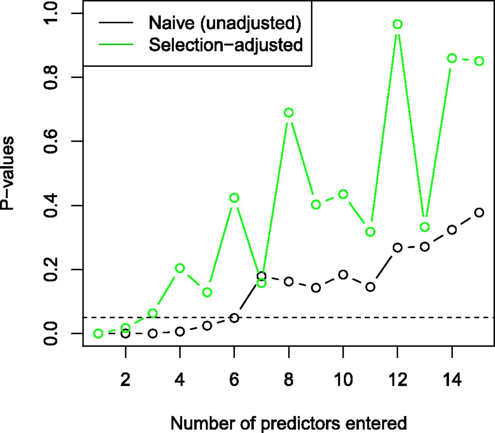

```{r setup, include=FALSE}
# R options
options(
  htmltools.dir.version = FALSE, # for blogdown
  show.signif.stars = FALSE,     # for regression output
  warm = 1
  )
# Set dpi and height for images
library(knitr)
# ggplot2 color palette with gray
color_palette <- list(gray = "#999999", 
                      salmon = "#E69F00", 
                      lightblue = "#56B4E9", 
                      green = "#009E73", 
                      yellow = "#F0E442", 
                      darkblue = "#0072B2", 
                      red = "#D55E00", 
                      purple = "#CC79A7")

options(htmltools.dir.version = FALSE)
knitr::opts_chunk$set(
	fig.align = "center",
	fig.height = 3.75,
	fig.width = 6.25,
	message = FALSE,
	warning = FALSE
)
```

```{r echo=FALSE, message=FALSE, warning=FALSE}
library(tidyverse)
library(caret)
library(MASS)
set.seed(123)
n <- 1000
p <- 20
y <- rnorm(n, 0, 1)
x <- matrix(rnorm(n * p), nrow = n)
dat <- data.frame(y, x)
```

### An activity

Load the dataset `dat`, which contains 2,000 observations of an outcome variable
`y` and 100 predictors labeled `X1` through `X100`. Using your favorite 
model/variable selection techniques for linear regression, come up with the 
"best" model (you choose what that means!).

.question[
What was the form of the final model you chose? Is there sufficient evidence 
that at least one of these $\beta$ terms is non-zero? That is, test the 
following hypotheses:

- $H_0:\beta_1 = \beta_2 = \cdots = \beta_{100} = 0$
- $H_1:$ At least one $\beta_k \neq 0$ for $k = 1, 2, \cdots, 100$.

What might you conclude with these data? 
]

---

### Model selection

.question[
Why do we even want to select a model?
]

--

We might want to **explain** or **describe** relationships in populations (often
by performing statistical inference on a sample from this population). In some
cases, this might give us causal or mechanistic understanding of the phenomenon
at hand; in others, we might only be able to explore associations.

We alternatively might want to **predict** values of new observations, often by
examining how well our model does using our data at hand in terms of performance
on holdout data.

---

### Explanation vs. prediction

Is there a relationship between one-and-done status and time-to-retirement 
(while controlling for potential confounding factors)?

Given a patient's characteristics (including whether they are a one-and-done), 
can we predict their time-to-retirement? Can we come up with a model that does 
the best job of doing so?

We might use similar (or even the same) tools to both cases, but these are
**distinct** questions. With that said, we're often interested in addressing
both questions.

See also this Stack Exchange discussion [here](https://stats.stackexchange.com/questions/1194/practical-thoughts-on-explanatory-vs-predictive-modeling).

---

### Model selection

.question[
Why do we even want to select a model?
]

"Choosing the best model" is an unfortunate and perhaps misleading use of words.
In explaining our data, there might be multiple reasonable models that all do
an acceptable job explaining.

We might also consider .vocab[parsimony]. Ease of explanation and 
conceptualization might more than make up for a marginal increase in some
metric.

---

### Cross-validation for prediction

Leave-one-out CV: sequentially leave out each one of our observations and fit
model on the remainder to capture prediction accuracy. 
- Convenient closed-form results for linear regression, otherwise 
computationally expensive.
- Not great in practice - only small changes are considered.

k-fold CV: partition data into k mutually exclusive partitions; use each 
partition as test set for models trained on remainder of data (so each datapoint
is used in the test set once).
- Works well in practice, but can be sensitive to random partitions
- Averaging over random partitions can help with robustness.

---

### Stepwise selection

$R^2_{adj}$, $C_p$, $AIC$, $BIC$, etc. are all used to quantify some notion of
prediction error. These quantities are often used as stopping criteria for 
stepwise regression techniques.

In examining these quantities, they seek to maximize (or minimize) some function
of the (log-)likelihood, with perhaps a penalty term based on the number of
chosen parameters/variables in the model.
- AIC penalizes linearly in $p$
- BIC penalizes like $p\log(n)$

---

### Stepwise selection

.vocab[Greedy] algorithms for variable selection. 

.vocab[Backward elimination]: 
- Evaluate some criterion for a "full" model
- Sequentially delete each variable and evaluate the same criterion
- Choose the model with the best chosen metric, repeating as necessary until
further deletion does not improve the model

.vocab[Forward selection]:
- Evaluate some criterion for an intercept-only model
- Sequentially add each variable and evaluate the same criterion
- Choose the model with the best chosen metric, repeating as necessary until
further addition does not improve the model

Hybrid forward/backward methods also exist, adding or deleting as necessary.

---

### Stepwise selection

Automatic stepwise methods are very popular, but not great in practice (e.g., 
horrible in the presence of colinearity, and this isn't even the worst problem 
with them!).

> *"Personally, I would no more let an automatic routine select my model than I* 
*would let some best-fit procedure pack my suitcase."* - Ronan Conroy.

---

### LASSO (and friends)

Instead of ordinary least squares, which minimizes the sum of squared errors
over the covariate vector $\beta$

\begin{align*}
\min_{{\beta}} \frac{1}{n}\big|\big|Y - {X\beta}\big|\big|^2_2,
\end{align*}

LASSO adds the additional $L_1$ constraint

\begin{align*}
\big|\big|{\beta}\big|\big|_1 \le t,
\end{align*}

and is a special case of elastic net.

Similar automatic regularization has been proposed for other settings such as 
for GLMs, GEE, and survival data. Note that LASSO has a nice Bayesian 
interpretation in terms of a double-exponential prior on regression parameters.

---

### LASSO (and friends)

The penalty that LASSO imposes on regression coefficients takes a specific
shape - because it is "sharp" at zero, LASSO can also set some coefficients to
be *exactly* zero, thus resulting in variable selection (although it has 
some issues...).

Changing the form of this penalty results in other techniques, e.g., MCP, SCAD 
penalties.

Penalized regression techniques are a very interesting field of research and
have application beyond variable selection - I encourage you to take further
courses on then.  Of course, you should always be careful with such automatic 
regularization procedures for variable selection purposes!

---

### Classification

What about for classification tasks?

- .vocab[Bagging]: Classifiers are created from bootstrap resamples
- .vocab[Boosting]: Similar, but in future iterations of resampling, weighting
is used for misclassifications to "focus" on areas where the model performed
poorly.

---

### Back to our activity...

```{r}
m1 <- lm(y ~ ., data = dat); round(summary(m1)$coef[-1,], 3)
```

---

### Back to our activity...

```{r}
m2 <- lm(y ~ X1 + X11 + X19, data = dat)
summary(m2)

```

---

### Back to our activity...

```{r, warning = F, message = F}
library(MASS)
m3 <- stepAIC(m1, direction = "both", trace = F)
summary(m3)
```

---

### Back to our activity...

```{r}
set.seed(123); n <- 1000; p <- 20; y <- rnorm(n, 0, 1)
x <- matrix(rnorm(n * p), nrow = n); dat <- data.frame(y, x)
m4 <- lm(y ~ X1 + X11 + X16 + X19, data = dat); summary(m4)
```

---

### Back to our activity...

Remember, if the null hypothesis is true, then p-values should have a uniform
distribution on (0, 1).

```{r, cache = T}
temp <- numeric(5000)
for(i in 1:5000){
  set.seed(i)
  y <- rnorm(n, 0, 1); x <- matrix(rnorm(n * p), nrow = n);
  dat <- data.frame(y, x)
  mod <- summary(lm(y ~ ., data = dat))
  temp[i] <- pf(mod$fstatistic[1], mod$fstatistic[2], mod$fstatistic[3], lower.tail = F)
}
```

---

### Back to our activity...

```{r, fig.height = 4, fig.width = 10}
round(temp[1:25], 3)
hist(temp, xlab = "p-value from overall F-test", 
     ylab = "Count", main = "")
```

---

### Back to our activity...

```{r, cache = T}
temp <- numeric(25)
for(i in 1:25){
  set.seed(i)
  y <- rnorm(n, 0, 1); x <- matrix(rnorm(n * p), nrow = n);
  dat <- data.frame(y, x)
  mod <- summary(stepAIC(lm(y ~ ., data = dat), direction = "both", trace = F))
  temp[i] <- pf(mod$fstatistic[1], mod$fstatistic[2], mod$fstatistic[3], lower.tail = F)
}
round(temp, 3)
```

--

.question[
What do you notice? What's going on?
]

---

<!-- ### The problem with post-selection inference -->

<!-- The p-values from the models in the previous example are conditioned on the -->
<!-- fact that we've already "chosen" those variables of interest to use (e.g.,  -->
<!-- from stepwise selection, LASSO, SCAD, etc.).  -->

<!-- However,  inference for regression models assumes that we've chosen the model -->
<!-- formulation "independently" of the data (i.e., that it was fixed beforehand). -->

<!-- Thus, performing statistical inference using the post-selection values is not -->
<!-- appropriate (even if asymptotically your selection procedure correctly chooses -->
<!-- variables with probability 1). -->

<!-- --- -->

### The problem with post-selection inference

Note that we chose our final model *because it did a good job with these data*.

- In classical statistical theory, data is assumed to be generated from a known
model, with inference for parameters performed on this known model.
- In the real world, it's often the case that the generating mechanism is 
unknown, *with a model being chosen based on the data*.
- The selection process that produces a model is itself random, which affects
the sample distriutions of the post-selection parameter estimates. These may 
change dramatically after conditioning on model selection procedures.

--

Performing statistical inference on the same data we used to choose our model
is not appropriate - *even if* asymptotically your selection procedure correctly
chooses variables almost surely!

---

### The problem with post-selection inference

- Rhee et al. (2003) studied HIV drugs and predicted drug resistance based on
location of genetic mutations.
- Using forward selection, naive p-values suggest six significant predictors.
- However, selection-adjusted p-values only suggest two significant predictors 
(figure below from Taylor and Tibshirani, 2015, *PNAS*):

```{r, eval=TRUE, echo=FALSE, warning = F, message = F, out.width = "55%"}
library(knitr)

```

---

### The problem with post-selection inference

So what can we do?

- Split the data - perform model selection using only part of the data, and then
use that model on the remaining data.
- Post-selection inferential methods - e.g., relying on polyhedral lemma for
LASSO, etc. 
- Ignore the problem entirely.

Post-selection inference is an active field of research and many powerful
and complex tools are available. In your own analyses, just be cautious of
running into this situation.