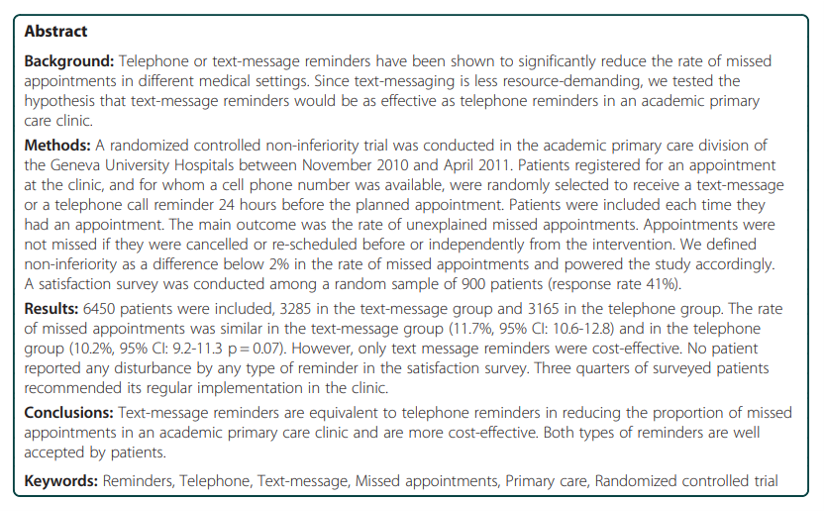
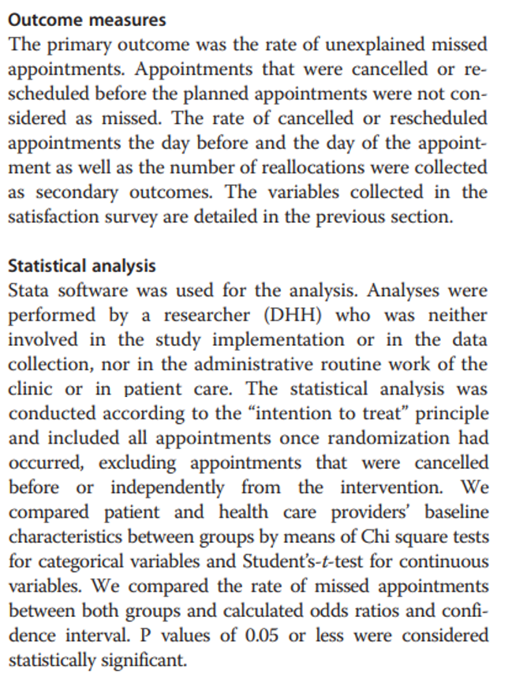
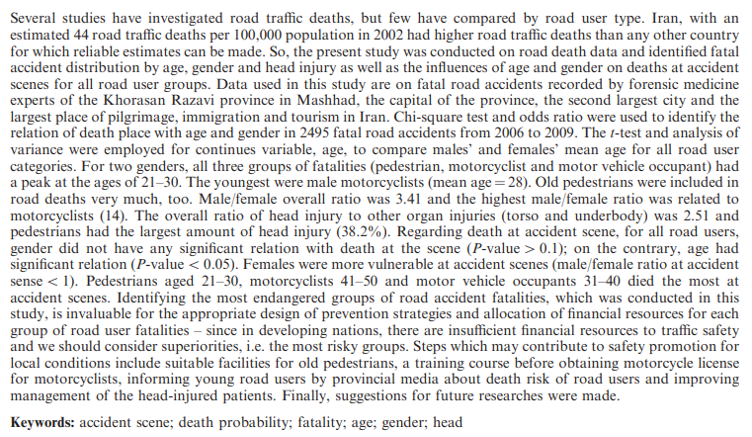
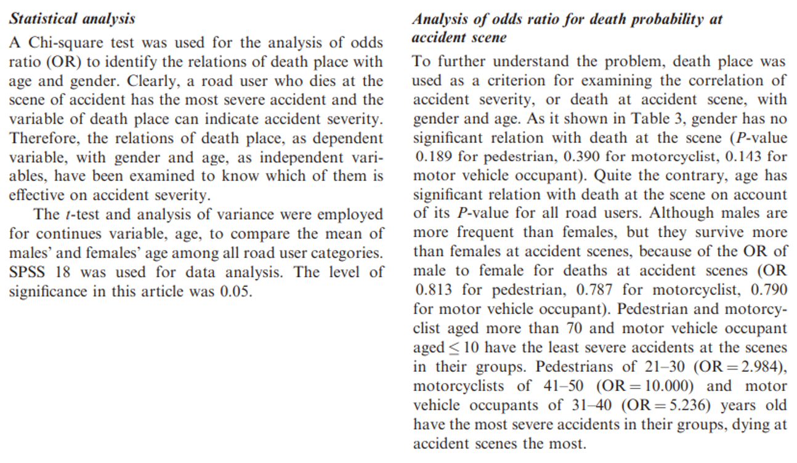
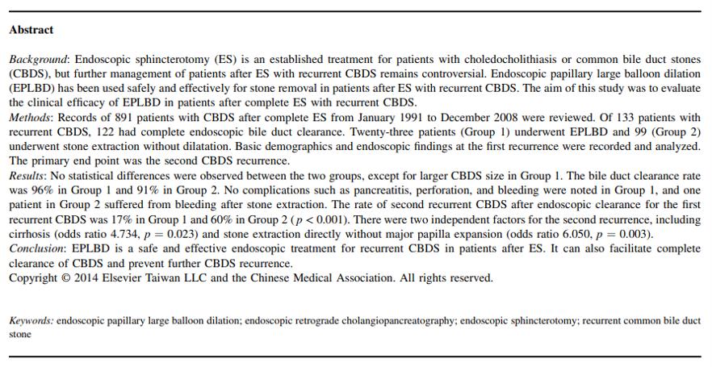
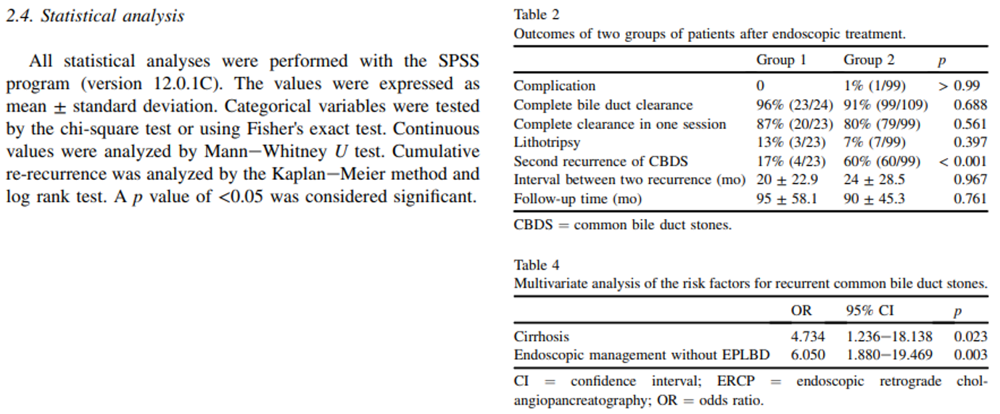
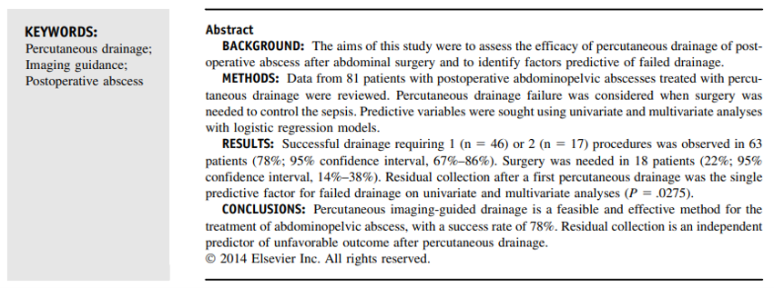
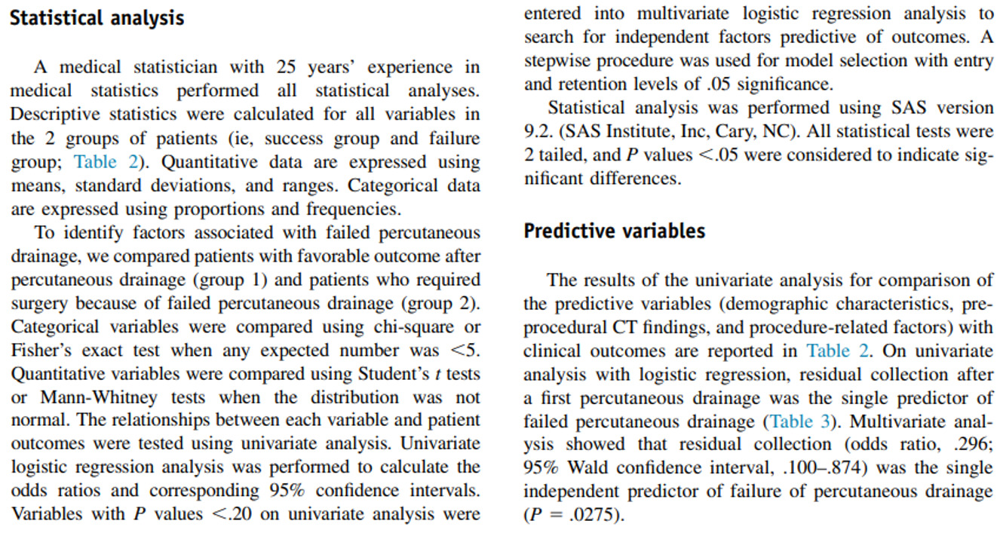

```{r setup, include=FALSE}
# R options
options(
  htmltools.dir.version = FALSE, # for blogdown
  show.signif.stars = FALSE,     # for regression output
  warm = 1
  )
# Set dpi and height for images
library(knitr)
# ggplot2 color palette with gray
color_palette <- list(gray = "#999999", 
                      salmon = "#E69F00", 
                      lightblue = "#56B4E9", 
                      green = "#009E73", 
                      yellow = "#F0E442", 
                      darkblue = "#0072B2", 
                      red = "#D55E00", 
                      purple = "#CC79A7")

options(htmltools.dir.version = FALSE)
knitr::opts_chunk$set(
	fig.align = "center",
	fig.height = 3.75,
	fig.width = 6.25,
	message = FALSE,
	warning = FALSE
)
```

```{r echo=FALSE, message=FALSE, warning=FALSE}
library(tidyverse)
library(knitr)
```

### What is peer review?

.vocab[Peer review] is the "expert assessment of submitted materials" (Walker)
and is used to help ensure that published materials are of high quality and
free from mistakes. It is used to maintain quality standards and credibility
in shared results. Many times peer review is blinded, which allows for more
honest and constructive comments.

Peer review is *not* limited to academic settings and journal submissions!

---

### What is peer review?

Peer reviewers are tasked with providing a dispassionate evaluation of the work
in question - this review is often used for decision-making purposes on behalf
of a larger institution.

Useful peer reviews provide helpful feedback (both positive and negative) about
the relative strengths and weaknesses of the piece being reviewed. 

Just because there are no mistakes doesn't necessarily mean that an article is
worthy of publication!

---

### What is peer review?

.question[
Always keep the overall goal in mind: to provide an objective evaluation of the
work in question
]

- **Describe - Evaluate - Suggest** framework
- Keep in mind some of the questions asked for Case 1 - these are great places
to start!

---

### Individual Activity 1

Due Friday, February 11. This is an individual assignment; you may not
communicate with anyone except the instructor regarding this assignment.

You are asked to write a formal peer review for a manuscript (posted to Sakai). 
This **will count** toward your final grade.

In grading this assignment, I will evaluate whether you are comprehensive in
identifying strengths and weaknesses of the posted paper, and whether you
fully address all potential issues and propose reasonable solutions or next
steps. You may consider using the "Grade considerations" section of Case 1 as
a template for your own peer review; note that I will be using this same
set of criteria to evaluate your evaluation (whoa, meta!). 

Be *specific* in your commentary - it often helps to provide direct examples
from the text (you may reference pages, paragraph numbers, quotes, etc.) and
explain why a particular passage is strong or problematic.

---

### Example 1

```{r, eval=TRUE, echo=FALSE, warning = F, message = F, out.width = "100%"}

```

---

### Example 1

```{r, eval=TRUE, echo=FALSE, warning = F, message = F, out.width = "100%"}

```

---

### Example 1

```{r, eval=TRUE, echo=FALSE, warning = F, message = F, out.width = "50%"}

```

---

.small[
In this paper, the authors describe results from a non-inferiority trial 
comparing text messages vs. telephone calls for reducing missed hospital
appointments. In examining the rate of missed appointments using a test of
proportions, the authors did not find evidence that text messages were inferior
to traditional calls, furthermore finding that texts were cost-effective while
calls were not. The information presented in the abstract was clear and 
effectively communicated the advantages of using a text-based approach.

However, the article made an equivalence conclusion despite the non-
inferiority design; this is an inappropriate statement given the methodology. 
An additional methodological concern would be the simple bivariate analysis; no 
attempt was made to control for potential confounding factors or even discuss
them, which may limit the validity
of the conclusions (e.g., perhaps patients in the text-message group
happened to have more serious initial consults, making them *a priori* more 
likely to attend a follow-up regardless). You may consider regression analysis 
to account for this. We also note the lack of a non-intervention group for 
comparison; it may be worth discussing the potential 
ramifications of this trial design, particular in terms of real-world 
conclusions that can be drawn.]

---

### Example 2

```{r, eval=TRUE, echo=FALSE, warning = F, message = F, out.width = "100%"}

```

---

### Example 2

```{r, eval=TRUE, echo=FALSE, warning = F, message = F, out.width = "100%"}

```

---

### Example 2

```{r, eval=TRUE, echo=FALSE, warning = F, message = F, out.width = "100%"}

```

---

### Example 3

```{r, eval=TRUE, echo=FALSE, warning = F, message = F, out.width = "100%"}

```

---

### Example 3

```{r, eval=TRUE, echo=FALSE, warning = F, message = F, out.width = "100%"}

```

---

### Example 3

```{r, eval=TRUE, echo=FALSE, warning = F, message = F, out.width = "100%"}

```

---

### Example 4

```{r, eval=TRUE, echo=FALSE, warning = F, message = F, out.width = "100%"}

```

---

### Example 4

```{r, eval=TRUE, echo=FALSE, warning = F, message = F, out.width = "100%"}

```

---

### Example 4

```{r, eval=TRUE, echo=FALSE, warning = F, message = F, out.width = "100%"}

```
