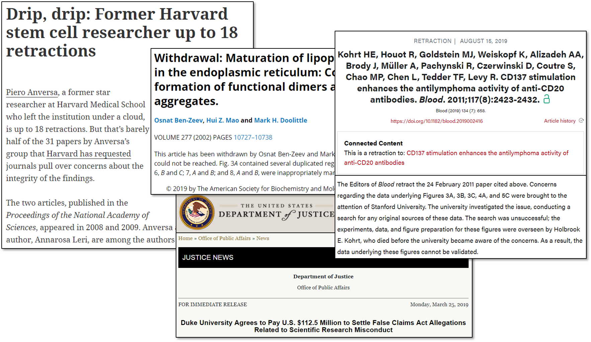
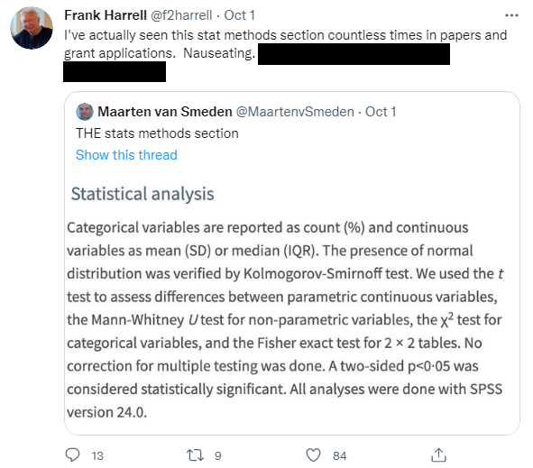
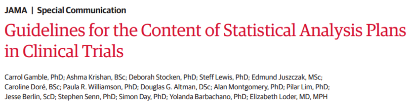
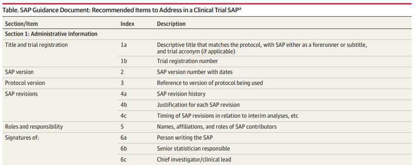
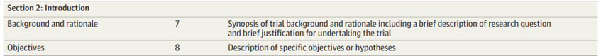
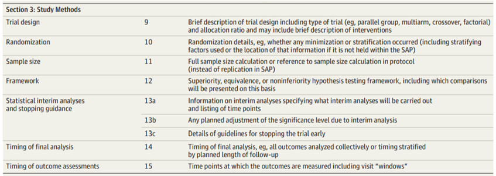
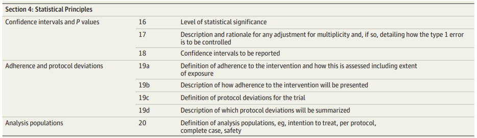
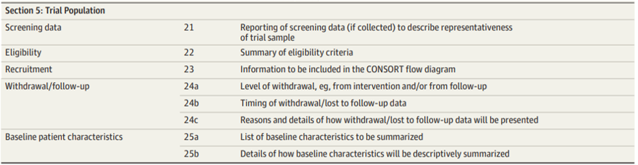
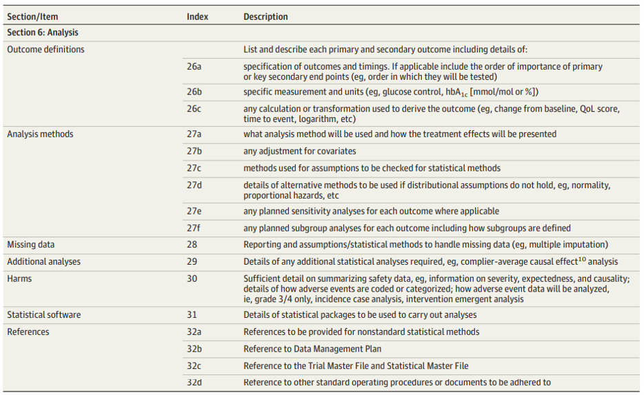
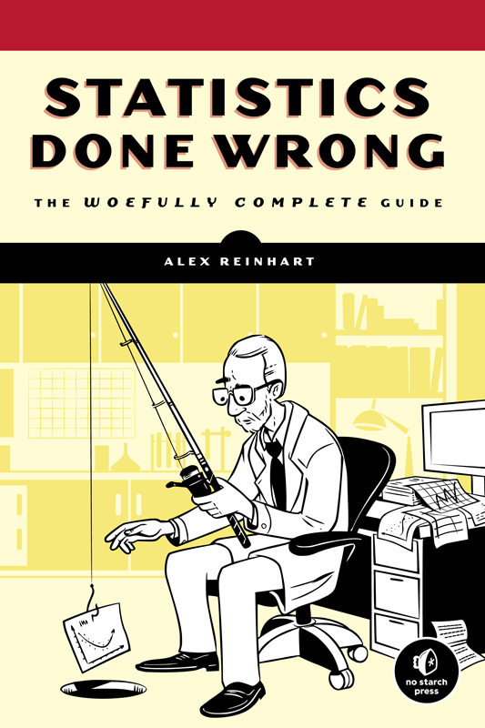

```{r setup, include=FALSE}
# R options
options(
  htmltools.dir.version = FALSE, # for blogdown
  show.signif.stars = FALSE,     # for regression output
  warm = 1
  )
# Set dpi and height for images
library(knitr)
# ggplot2 color palette with gray
color_palette <- list(gray = "#999999", 
                      salmon = "#E69F00", 
                      lightblue = "#56B4E9", 
                      green = "#009E73", 
                      yellow = "#F0E442", 
                      darkblue = "#0072B2", 
                      red = "#D55E00", 
                      purple = "#CC79A7")

options(htmltools.dir.version = FALSE)
knitr::opts_chunk$set(
	fig.align = "center",
	fig.height = 3.75,
	fig.width = 6.25,
	message = FALSE,
	warning = FALSE
)
```

```{r echo=FALSE, message=FALSE, warning=FALSE}
library(tidyverse)
library(knitr)
```

### Reproducibility and replicability

.vocab[Reproducibility]: being able to take the original data and code to 
reproduce all numerical findings

.vocab[Replicability]: being able to independently repeat an entire study
without use of the original data (generally with the same methods)

Some best practices from the American Statistical Association:
- End-to-end scripting of research
- Use of version control and documentation
- Publication of code along with data

---

### Reproducibility and replicability


```{r, echo=FALSE, warning = F, fig.align = 'center', out.width = "100%"}
library(knitr)

```

---

### Statistical analysis plans

A .vocab[statistical analysis plan] is a tool that
establishes the research aims, study design and variables, statistical methods
and models, and rationale for choosing such methods. It often includes
analyses regarding sample size and power, as well as logistical details 
regarding any randomization procedure, data entry, quality assurance, and
database management.

Importantly, SAPs are written *prior* to collecting data. 

.question[
Why is having an SAP important?
]

---

### What is an SAP?

```{r, echo=FALSE, warning = F, fig.align = 'center', out.width = "80%"}
library(knitr)

```

---

### What is an SAP?

The methods section written on the previous slide is basically saying:

> We will use beakers to hold solutions and burettes to perform titration.

SAPs should provide *strategies* and *rationales* instead of simply listing 
procedures. Explain *why* each statistical tool is being used and how it 
specifically addresses one of the research aims (don't be afraid to restate 
them!). 

Discuss rationale, appropriateness, advantages, and limitations, including
mention of competing reasonable methods that were not selected (and why).

---

### What is an SAP?

Strong SAPs will discuss main analyses (used to drive storyline of paper), but
also include auxiliary analyses to support the main results:

- .vocab[Sensitivity analyses] help evaluate robustness of the main results to
assumptions or reasonable differences in choice of methods, inclusion of 
outliers, etc.
- .vocab[Goodness of fit analyses] help place main results in context of the
overall data.

--

Be *comprehensive* in anticipating data issues. Mention strategies for dealing
with incomplete data or missing data, questionable data values, violation of
distributional or modeling assumptions, and multiple comparisons.

---

### What is an SAP?

Provide detailed "template" mock-ups of all figures and tables to be included
in the main manuscript. You may consider including a detailed 
.vocab[data dictionary] providing variables you intend to collect, the timing
of variable collection (if multiple visits are specified), and the expected
format and units of such variables.

You may also refer to existing guidance for certain types of trials:

- [CONSORT](http://www.consort-statement.org/): Consolidated Standards of Reporting Trials
- [STROBE](https://www.strobe-statement.org/index.php?id=strobe-home): Strengthening the Reporting of Observational Studies in Epidemiology
- [TREND](https://www.cdc.gov/trendstatement/): Transparent Reporting of Evaluations with Nonrandomized Designs

---

### What to include in an SAP?

.question[
What sorts of considerations might you include in an SAP? Why might these
help ensure reproducibility *and* replicability of your studies?
]

---

### What to include in an SAP?

```{r, echo=FALSE, warning = F, fig.align = 'center', out.width = "100%"}
library(knitr)

```

---

### What to include in an SAP?

```{r, echo=FALSE, warning = F, fig.align = 'center', out.width = "100%"}
library(knitr)

```

---

### What to include in an SAP?

```{r, echo=FALSE, warning = F, fig.align = 'center', out.width = "100%"}
library(knitr)

```

---

### What to include in an SAP?

```{r, echo=FALSE, warning = F, fig.align = 'center', out.width = "100%"}
library(knitr)

```

---

### What to include in an SAP?

```{r, echo=FALSE, warning = F, fig.align = 'center', out.width = "100%"}
library(knitr)

```

---

### What to include in an SAP?

```{r, echo=FALSE, warning = F, fig.align = 'center', out.width = "100%"}
library(knitr)

```

---

### What to include in an SAP?

```{r, echo=FALSE, warning = F, fig.align = 'center', out.width = "100%"}
library(knitr)

```

---

### Power/sample size analysis

.question[
What is the definition of statistical .vocab[power] and why should we care?
]

--

.vocab[Power] is the probability of rejecting the null hypothesis when it is
false: P(reject $H_0$ | $H_0$ is false) - often calculated for *specific*
alternatives.

Check out an [interactive visualization](https://rpsychologist.com/d3/nhst/) of
some factors that are related to power.


---

### Power/sample size analysis

.question[
Why care about choosing a sample size/power?
]

--

- To show that under certain required conditions, a hypothesis test has a good
chance of showing the anticipated difference, if it really exists
- To be more confident that a null result is not simply a sample of excessive 
variability
- To show a funding agency that the study has a reasonable chance of reaching a
useful result
- To show that necessary resources (human, animal, financial,
time, etc.) will be minimized

--

Note that for multiple specific hypotheses of interest, each with their own
tests and estimates of interest, you may come to different conclusions when
evaluating each!

---

### Calculating power

Suppose $X \sim N(0, 3)$ and $Y \sim N(\_\_, \_\_)$, and that you are interested
in testing
\begin{align*}
H_0: \mu_X &= \mu_Y\\
H_1: \mu_X &\neq \mu_Y
\end{align*}

What is the anticipated power at $\alpha = 0.05$ if you have 20 subjects from
population $X$ and 20 from $Y$ if $Y \sim N(1, 3)$? How about $Y \sim N(5, 12)$?
What if we had 40 subjects from $Y$ or if we specified $\alpha = 0.01$ instead?

--

- Built-in functions in software
- Formulas do exist for certain types of (simple) analyses!
- In real-life, **simulation** is often used to simulate power across a wide
range of potential alternatives and across a wide range of potential data
patterns (demonstration given in class)

---

### Power/sample size analysis

**However**: there is *no* place for power when analyzing results -- it is
irrelevant for doing so!

- Power is only useful in the planning stages; observed confidence intervals
and point estimates are all that's needed for (frequentist) analysis.
- No additional information can be obtained by performing any kind of power
calculation.
- After data are collected, these are just previous conjectures about expected
behavior - they provide no assistance in interpreting the study's data.
- Inclusion of pre-study power analyses may lead to misinterpretations regarding
study results.

Post hoc power analyses are similarly worthless (similarly for sample size
analyses). 

---

### Power/sample size analysis

.question[
Does this in fact mean that power/sample size calculations are not important?
]

---

### A cautionary tale

```{r, echo=FALSE, warning = F, fig.align = 'center', out.width = "40%"}
library(knitr)

```

Example adapted from 
[Reinhart, 2015: Statistics Done Wrong](https://www.statisticsdonewrong.com/) 

---

### A cautionary tale

Suppose 100 independent researchers conducted 100 pilot studies in which the
true magnitude of the effect was small. Because these were pilot studies,
each investigator is only able to study a small number of patients.

--

Because of the small sample size, estimators have high variability -- there is
low .vocab[precision] in these estimates. Each investigator plans to test
the null hypothesis of zero effect (even though we can probably suspect that
any tests will have low power).

---

### A cautionary tale

Suppose the true unknown power of each test is 7%. We would expect 7 of the
investigators to obtain a statistically significant p-value and conclude that
the effect is not-zero.

These 7 investigators have made the *correct* decision - they have not made
false discoveries! Remember, the effect truly exists.

.question[
What are some potential consequences of this sequence of events?
]

---

### A cautionary tale

Because of the small sample size, the estimate of the *magnitude* of any effect
will be gigantic if the p-value is statistically significant (given the high
variability, how else would we have rejected the null hypothesis with such
few patients?).

**The p-value will be significant here only when the estimate happens to be large.**

.question[
With this understanding, what are some other potential consequences? How might
you relate this vignette to the replicability crisis?
]
