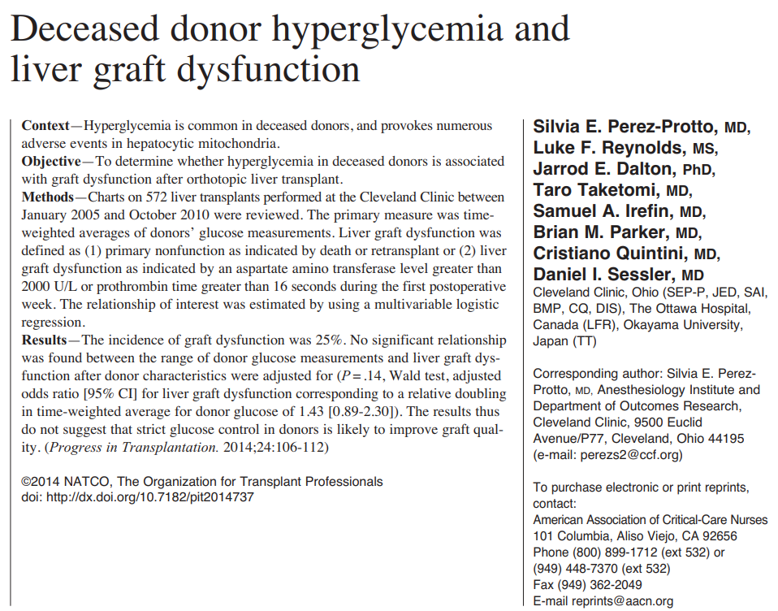
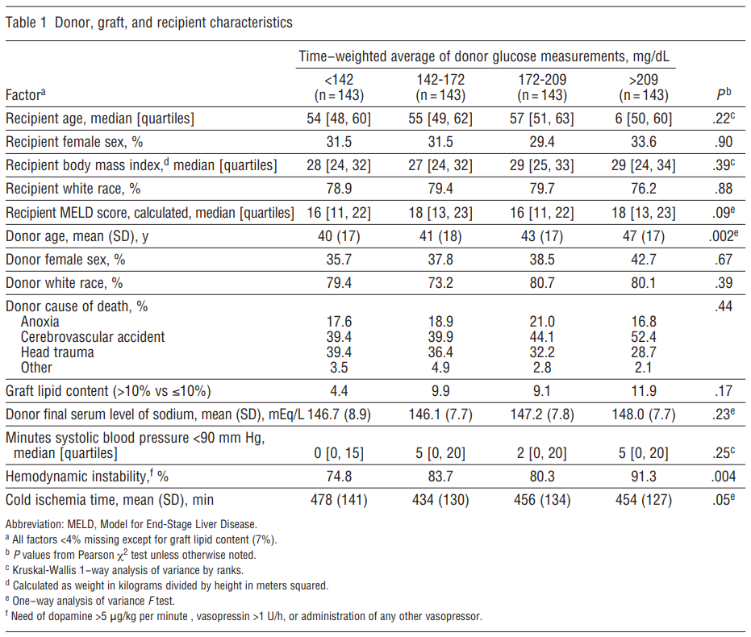
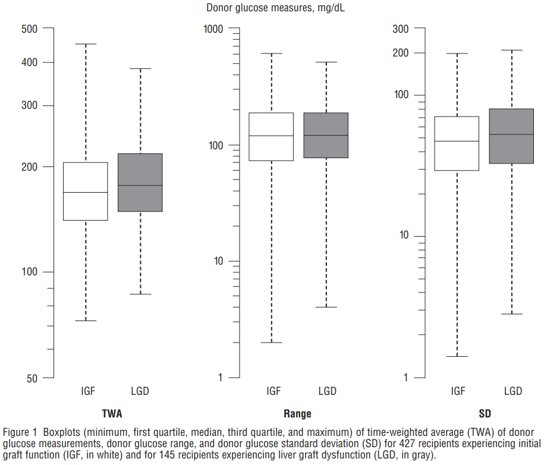
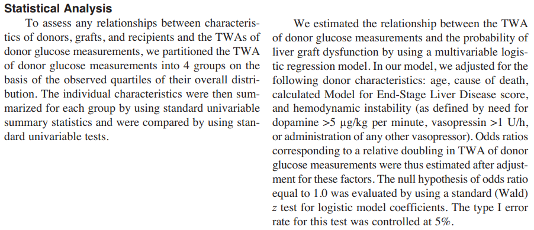
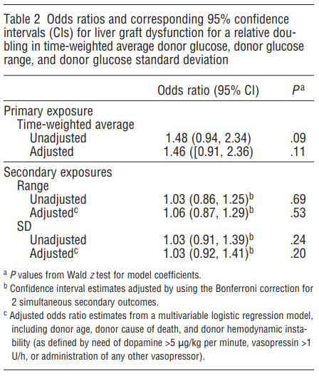

```{r setup, include=FALSE}
# R options
options(
  htmltools.dir.version = FALSE, # for blogdown
  show.signif.stars = FALSE,     # for regression output
  warm = 1
  )
# Set dpi and height for images
library(knitr)
# ggplot2 color palette with gray
color_palette <- list(gray = "#999999", 
                      salmon = "#E69F00", 
                      lightblue = "#56B4E9", 
                      green = "#009E73", 
                      yellow = "#F0E442", 
                      darkblue = "#0072B2", 
                      red = "#D55E00", 
                      purple = "#CC79A7")

options(htmltools.dir.version = FALSE)
knitr::opts_chunk$set(
	fig.align = "center",
	fig.height = 3.75,
	fig.width = 6.25,
	message = FALSE,
	warning = FALSE
)
```

```{r echo=FALSE, message=FALSE, warning=FALSE}
library(tidyverse)
library(knitr)
```

### Disclaimer

Today's class is an interactive in-class activity aimed at reproducing tables
and figures from an existing work, given only the dataset, data dictionary, and
original publication. These materials are available on the course Sakai page.

---

### Deceased donor hyperglycemia 

```{r, echo=FALSE, warning = F, fig.align = 'center', out.width = "80%"}
library(knitr)

```

---

### Deceased donor hyperglycemia 

```{r, echo=FALSE, warning = F, fig.align = 'center', out.width = "80%"}
library(knitr)

```

---

### Deceased donor hyperglycemia

```{r, echo=FALSE, warning = F, fig.align = 'center', out.width = "80%"}
library(knitr)

```

---

### Deceased donor hyperglycemia

```{r, echo=FALSE, warning = F, fig.align = 'center', out.width = "100%"}
library(knitr)

```

---

### Deceased donor hyperglycemia

```{r, echo=FALSE, warning = F, fig.align = 'center', out.width = "50%"}
library(knitr)

```