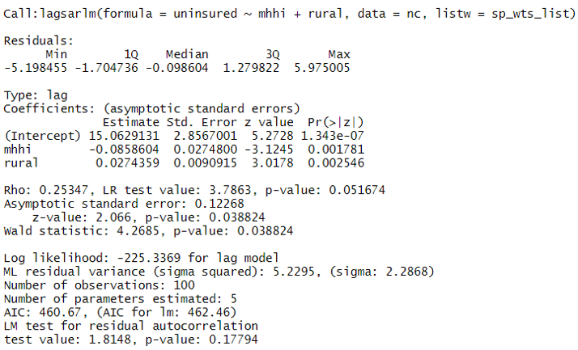
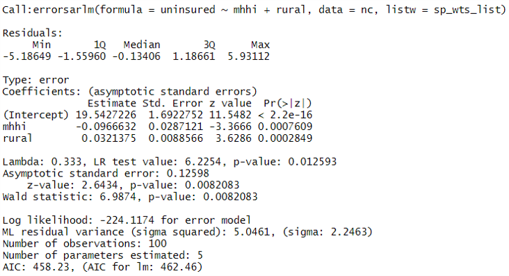

```{r setup, include=FALSE}
# R options
options(
  htmltools.dir.version = FALSE, # for blogdown
  show.signif.stars = FALSE,     # for regression output
  warm = 1
  )
# Set dpi and height for images
library(knitr)
# ggplot2 color palette with gray
color_palette <- list(gray = "#999999", 
                      salmon = "#E69F00", 
                      lightblue = "#56B4E9", 
                      green = "#009E73", 
                      yellow = "#F0E442", 
                      darkblue = "#0072B2", 
                      red = "#D55E00", 
                      purple = "#CC79A7")

options(htmltools.dir.version = FALSE)
knitr::opts_chunk$set(
	fig.align = "center",
	fig.height = 3.75,
	fig.width = 6.25,
	message = FALSE,
	warning = FALSE
)
```

```{r echo=FALSE, message=FALSE, warning=FALSE}
library(tidyverse)
library(sf)
library(spdep)
library(spatialreg)
```

### Motivating example

```{r, cache = T, echo = F}
nc <- st_read("data/nc.shp", quiet = TRUE)
health <- read_csv("data/nc_health_2.csv")
nc <- merge(nc, health, by = "name")
nc %>% 
  select(name, uninsured, mhhi, rural) %>% 
  st_drop_geometry() %>% 
  slice(1:15)
```

.question[
Is there an association between the adult uninsured % in each county and the
rurality of a county, adjusting for median household income?
]

---

### Linear regression model

```{r}
m1 <- lm(uninsured ~ rural + mhhi, data = nc)
summary(m1)
```

---

### Linear regression model

```{r}
temp <- tibble(res = m1$residuals, 
               fitted = m1$fitted.values)
ggplot(data = temp, aes(x = fitted, y = res)) + 
  geom_point() + 
  labs(x = "Fitted values", y = "Residuals",
       title = "Slight evidence of non-constant variance") +
  geom_hline(yintercept = 0, color = "red")
```

---

### Linear regression model

```{r}
ggplot(data = temp, aes(x = res)) + 
  geom_histogram(bins = 15) +
  labs(x = "Residuals", y = "Frequency",
       title = "Slight evidence of right-skew in residuals")
```

---

### Exploratory data analysis

```{r, eval = F, echo = F}
set.seed(1)
sp_wts <- poly2nb(nc, row.names=nc$name, queen = T)
sp_mat_list <-  nb2listw(sp_wts, style='B')

moran(nc$uninsured, sp_mat_list, nrow(nc), sum(sp_mat))
moran.mc(nc$uninsured, sp_mat_list, nsim = 1999)

moran(nc$rural, sp_mat_list, nrow(nc), sum(sp_mat))
moran.mc(nc$rural, sp_mat_list, nsim = 1999)

moran(nc$mhhi, sp_mat_list, nrow(nc), sum(sp_mat))
moran.mc(nc$mhhi, sp_mat_list, nsim = 1999)
```

```{r, echo = F, fig.width = 10, fig.height = 6}
ggplot(nc) + 
  geom_sf(aes(fill = uninsured)) +
  scale_fill_gradient(low = "#fee8c8", high = "#7f0000") +
  labs(title = "Spatial clustering of adult uninsured %",
       subtitle = "Moran's I = 0.16; p = 0.005",
       fill = "Uninsured %") +
  theme_bw() +
  theme(legend.position="bottom")
```

---

### Exploratory data analysis

```{r, echo = F, fig.width = 10, fig.height = 6}
ggplot(nc) + 
  geom_sf(aes(fill = rural)) +
  scale_fill_gradient(low = "#fee8c8", high = "#7f0000") +
  labs(title = "Spatial clustering of rurality",
       subtitle = "Moran's I = 0.15; p = 0.010",
       fill = "Rural %") +
  theme_bw() +
  theme(legend.position="bottom")
```

---

### Exploratory data analysis

```{r, echo = F, fig.width = 10, fig.height = 6}
ggplot(nc) + 
  geom_sf(aes(fill = mhhi)) +
  scale_fill_gradient(low = "#fee8c8", high = "#7f0000") +
  labs(title = "Spatial clustering of median HHI",
       subtitle = "Moran's I = 0.43; p < 0.001",
       fill = "Thousands USD") +
  theme_bw() +
  theme(legend.position="bottom")
```

---

### Independence assumption of model is violated!

```{r, fig.width = 10, fig.height = 6, echo = F}
m1 <- lm(uninsured ~ mhhi + rural, data = nc)
nc$stdres <- scale(residuals(m1))[,1]

ggplot(nc) + 
  geom_sf(aes(fill = stdres)) +
  scale_fill_gradient2(low = "deepskyblue", high = "gold",
                       limits = c(-3, 3)) +
  labs(title = "Standardized residuals for linear model",
       subtitle = "Evidence of spatial clustering",
       fill = "Std. Resid.") +
  theme_bw() +
  theme(legend.position="bottom")
```

---

### Moran's I for model residuals

```{r}
nc_sp <- as(nc, "Spatial")
sp_wts <- poly2nb(nc_sp)
sp_wts_mat <- nb2mat(sp_wts, style='W')
sp_wts_list <- mat2listw(sp_wts_mat, style='W')
```

```{r, eval = F}
lm.morantest(m1, sp_wts_list, alternative = "two.sided")
```

.question[
Why can't we simply calculate Moran's I on the residuals themselves like we 
did previously (note the different function)?
]

---

### Moran's I for model residuals

```{r}
lm.morantest(m1, sp_wts_list, alternative = "two.sided")
```

.question[
What might we conclude? Is there evidence for spatial clustering or dispersion
among the residuals in our model? What are the consequences?
]

---

### Spatial regression models

There are two main ways of dealing with spatial dependence in regression models:
spatial error models, and spatial lag models*

.vocab[Spatial error models]: assume that the error terms are correlated;
however, independence may still be reasonable - perhaps the residuals are
correlated due to an unmeasured confounding variable (and were to measure
them, no longer have issues with spatial dependency).

.vocab[Spatial lag models]: independence of observations is violated due to 
some underlying spatial process - perhaps the *outcome itself* is associated
with the outcome in neighboring spatial areas (and must be handled by 
incorporating spatial lag as a predictor).

*.small[(let's not get into CAR vs. SAR models for now...)]

---

### Spatial regression models

Spatial error model:

\begin{align*}
Y = \mathbf{X}\boldsymbol{\beta} + \lambda\mathbf{W}\mathbf{u} + \boldsymbol{\epsilon}
\end{align*}

Spatial lag model:

\begin{align*}
Y = \rho\mathbf{W}Y + \mathbf{X}\boldsymbol{\beta} + \boldsymbol{\epsilon}
\end{align*}

We can use Lagrange multiplier tests for *specific* alternatives by comparing
each of these models to a constrained model (where $\lambda$ or $\rho$ equal 0,
respectively).

---

### Tests for spatial dependence

```{r}
lm.LMtests(m1, sp_wts_list, test = c("LMerr", "LMlag"))
```

---

### Tests for spatial dependence

There was evidence against both null hypotheses. Unfortunately, the Lagrange
multiplier tests also have some power against the other alternative, and so if
both are significant, we still don't have a good idea regarding which type(s) of
spatial dependence might be present.

We can use robust tests (Anselin et al. 1996) to account for this consideration.

---

### Tests for spatial dependence

```{r}
lm.LMtests(m1, sp_wts_list, test = c("RLMerr", "RLMlag"))
```

---

### Aside: SARMA models

\begin{align*}
Y = \rho\mathbf{W}Y + \mathbf{X}\boldsymbol{\beta} + \lambda\mathbf{W}\mathbf{u} + \boldsymbol{\epsilon}
\end{align*}

Presence of *both* spatial error dependency and spatial lag

```{r}
lm.LMtests(m1, sp_wts_list, test = c("SARMA"))
```

---

### Fitting a spatial lag model

\begin{align*}
Y = \rho\mathbf{W}Y + \mathbf{X}\boldsymbol{\beta} + \boldsymbol{\epsilon}
\end{align*}

```{r}
m2 <- lagsarlm(uninsured ~ mhhi + rural, data = nc, 
               listw = sp_wts_list)
```

Remember, spatial lag suggests that the value of the response variable in one
area might *depend* on the value of the response(s) of its neighbor(s), *beyond*
other potentially unaccounted-for confounders. In these models, we assume that 
neither the outcomes of the observations are independent, *nor* the errors
are independent.

Tests for spatial dependence should not be the only criterion by which you
decide what type of spatial model to fit!

---

### Fitting a spatial lag model

```{r, eval = F}
summary(m2)
```

```{r, echo=FALSE, out.width="100%"}

```

---

### Interpreting a spatial lag model

.question[
Can we say that on average, for each additional $1,000 increase in median 
household income in a county, we expect to see a decrease of 8.6 percentage
points in the adult uninsured population (holding rurality constant)?
]

--

**No!**

---

### Interpreting a spatial lag model

Median household income and rurality in Durham county are associated with
the uninsured rate in Durham county.

--

However, the uninsured rates of neighboring counties are also associated with
the uninsured rate in Durham county!

--

Even worse, the median household incomes and rurality of neighboring counties
are associated with the uninsured rate in their respective counties as well!

...and so on.

--

In short, the covariate effects depend on both the .vocab[direct effect] in
the associated spatial unit as well as the .vocab[indirect effect] due to
spatial lag from its neighboring units.

---

### Interpreting a spatial lag model

```{r}
sp_wts_sparce <- as(sp_wts_list, "CsparseMatrix")
traces <- trW(sp_wts_sparce, type="MC")
m2_decomp <- impacts(m2, tr = traces, R = 1000)
m2_decomp
```

---

### Interpreting a spatial lag model

```{r}
summary(m2_decomp)$direct_sum
```

---

### Interpreting a spatial lag model

```{r}
summary(m2_decomp)$indirect_sum
```

---

### Interpreting a spatial lag model

```{r}
summary(m2_decomp)$total_sum
```

---

### Fitting a spatial error model

\begin{align*}
Y = \mathbf{X}\boldsymbol{\beta} + \lambda\mathbf{W}\mathbf{u} + \boldsymbol{\epsilon}
\end{align*}

```{r}
m3 <- errorsarlm(uninsured ~ mhhi + rural, data = nc, 
                 listw = sp_wts_list)
```

Remember, spatial error models suggest that the spatial dependency comes through
the error term only, and estimates variables treating spatial dependence as
a nuisance parameter. In these models, we still assume that the outcomes of the
observations are independent, but we do *not* need to assume that the errors
are independent.

Once again, tests for spatial dependence should not be the only criterion by which you
decide what type of spatial model to fit!

---

### Fitting a spatial error model

```{r}
summary(m3)
```

```{r, echo=FALSE, out.width="100%"}

```

---

### What about generalized linear models?

We can use .vocab[Moran eigenvector filtering] to attempt to remove spatial
autocorrelation from "residuals" of GLMs.

In this method, we include specific eigenvectors of the spatial weight matrix as 
predictors in the model of interest:

--

- The spatial weights matrix is symmetrized and eigenvectors are calculated.
- Candidate models are fit including the predictors in the original model and 
each of individual eigenvectors in turn.
- The model that has the lowest Moran's I is chosen to "continue." Individual
eigenvectors are added to this model, and the process repeats until the Moran's
I is no longer significant at a prespecified level.

See `R` function documentation for the
appropriate function 
[here](https://www.rdocumentation.org/packages/spdep/versions/1.0-2/topics/ME)
(speaking of which, the documentation for the `spdep` pacakge is excellent!).

For more information, come see me in office hours.

---

### Resources and references

[The Center for Spatial Data Science](https://spatialanalysis.github.io/) at
the University of Chicago

Additional resources (for R) which may be helpful are available [here](https://spatialanalysis.github.io/links/)