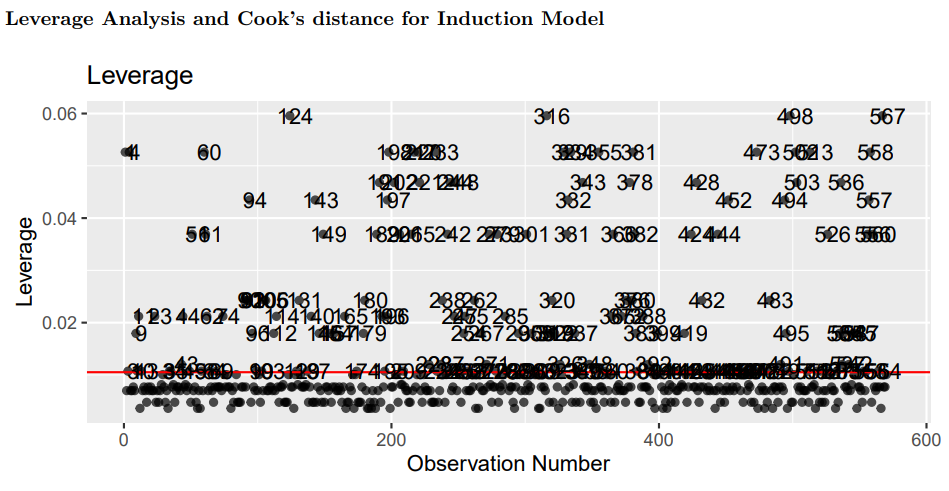
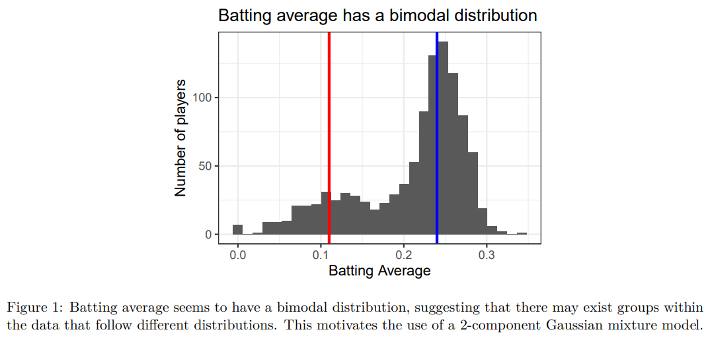
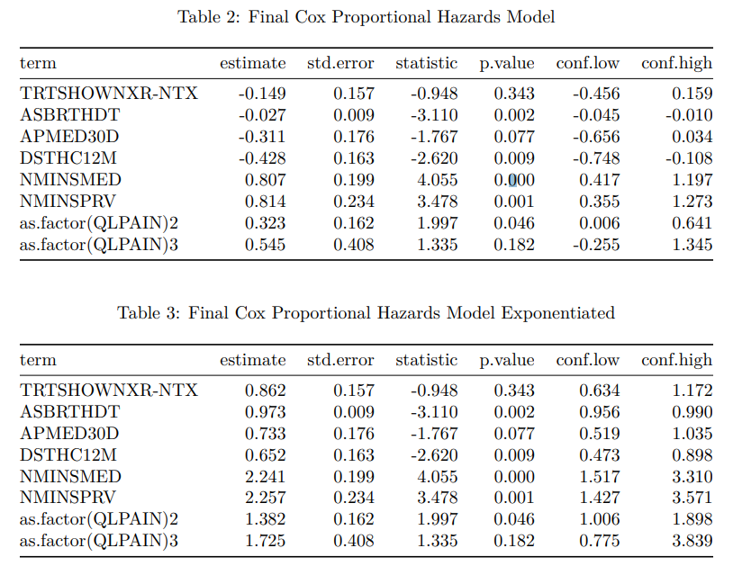
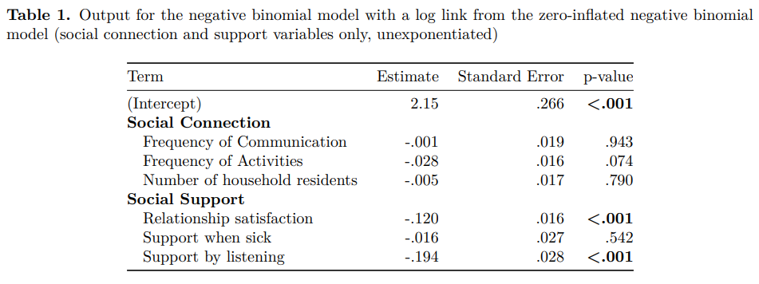

```{r setup, include=FALSE}
# R options
options(
  htmltools.dir.version = FALSE, # for blogdown
  show.signif.stars = FALSE,     # for regression output
  warm = 1
  )
# Set dpi and height for images
library(knitr)
# ggplot2 color palette with gray
color_palette <- list(gray = "#999999", 
                      salmon = "#E69F00", 
                      lightblue = "#56B4E9", 
                      green = "#009E73", 
                      yellow = "#F0E442", 
                      darkblue = "#0072B2", 
                      red = "#D55E00", 
                      purple = "#CC79A7")

options(htmltools.dir.version = FALSE)
knitr::opts_chunk$set(
	fig.align = "center",
	fig.height = 3.75,
	fig.width = 6.25,
	message = FALSE,
	warning = FALSE
)
```

```{r echo=FALSE, message=FALSE, warning=FALSE}
library(tidyverse)
library(knitr)
```

### Tables and figures

Tables and figures are some of the most important ways to quickly and 
effectively communicate information. Although there are many different types of
tables and figures you might make, effective ones all follow the same set of
guidelines - they are:

- .vocab[clear] in the information they display, such that readers can immediately
know the story behind the figure
- .vocab[concise] in providing the information, without any extraneous or otherwise
distracting components
- .vocab[correct] in their depiction, with an appropriate type of table or graph
provided to appropriately tell the story

.question[
We'll focus on concrete examples, determining what makes some of them strong 
and how we might fix certain issues in others.
]

---

### Example 1

```{r, eval=TRUE, echo=FALSE, warning = F, message = F, out.width = "100%"}
library(knitr)

```

---

### Example 2

```{r, eval=TRUE, echo=FALSE, warning = F, message = F, out.width = "100%"}
library(knitr)

```

---

### Example 3

```{r, eval=TRUE, echo=FALSE, warning = F, message = F, out.width = "100%"}
library(knitr)

```

---

### Example 4

```{r, eval=TRUE, echo=FALSE, warning = F, message = F, out.width = "100%"}
library(knitr)

```

---

### Example 5

```{r, eval=TRUE, echo=FALSE, warning = F, message = F, out.width = "100%"}
library(knitr)

```

---

### Example 6

```{r, eval=TRUE, echo=FALSE, warning = F, message = F, out.width = "100%"}
library(knitr)

```

---

### Example 7

```{r, eval=TRUE, echo=FALSE, warning = F, message = F, out.width = "100%"}
library(knitr)

```

---

### Example 8

```{r, eval=TRUE, echo=FALSE, warning = F, message = F, out.width = "80%"}
library(knitr)

```

---

### Example 9

```{r, eval=TRUE, echo=FALSE, warning = F, message = F, out.width = "80%"}
library(knitr)

```

---

### Example 10

```{r, eval=TRUE, echo=FALSE, warning = F, message = F, out.width = "80%"}
library(knitr)

```

---

### Example 11

```{r, eval=TRUE, echo=FALSE, warning = F, message = F, out.width = "70%"}
library(knitr)
include_graphics("img/issues5.png")
```

---

### Example 12

```{r, eval=TRUE, echo=FALSE, warning = F, message = F, out.width = "80%"}
library(knitr)

```

---

### Example 13

```{r, eval=TRUE, echo=FALSE, warning = F, message = F, out.width = "80%"}
library(knitr)

```

---

### Example 14

```{r, eval=TRUE, echo=FALSE, warning = F, message = F, out.width = "80%"}
library(knitr)

```

---

### Example 15

```{r, eval=TRUE, echo=FALSE, warning = F, message = F, out.width = "60%"}
library(knitr)

```

